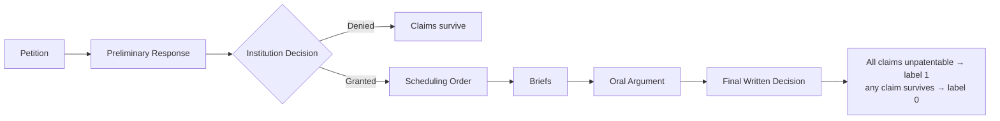
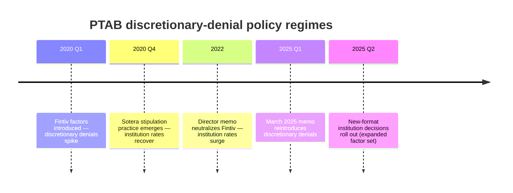

# ML-USPTO

Predicting **IPR (Inter Partes Review)** outcomes at the USPTO Patent Trial and Appeal Board (PTAB) from the PTAB Open Data Portal API.

This README is the running glossary and high-level map of the domain.

---

## 1. What is an IPR?

An **Inter Partes Review** is an administrative proceeding at the PTAB where a petitioner (typically a defendant being sued for infringement) asks the USPTO to cancel claims of an issued patent on prior-art grounds. Filing costs a client roughly **$150K–$250K**, so whether to file is a high-stakes decision we want to inform.

The case record follows a consistent ordering:

The **institution decision** is the first major gate. A denial is effectively a "claims survive" outcome for the patent owner, so the institution stage is baked into the final-outcome label we're predicting.

### Typical timeline

IPR timing is statutory (35 U.S.C. §§ 314, 316). End-to-end a case runs **~18 months** from petition to Final Written Decision, with two hard gates: institution (~6 months in) and FWD (≤12 months post-institution, extendable 6 months for good cause).

```mermaid
gantt
    title Typical IPR timeline (months from petition filing)
    dateFormat  X
    axisFormat  %s

    section Pre-institution
    Petition filed                      :milestone, m1, 0, 0
    Patent Owner Preliminary Response   :a1, 0, 3
    Institution decision window         :a2, 3, 6
    Institution decision                :milestone, m2, 6, 0

    section Trial (if instituted)
    Patent Owner Response               :b1, 6, 9
    Petitioner Reply                    :b2, 9, 12
    Patent Owner Sur-reply              :b3, 12, 13
    Oral hearing                        :milestone, m3, 15, 0
    Final Written Decision              :milestone, m4, 18, 0
```

Practical implication for modeling: we predict the **trial outcome** (month ~18) at **T₀ = petition filing** (month 0). Single-stage — no separate "institution decision" model. Every feature must be observable at T₀ or earlier; institution decisions, POPRs, FWDs and everything else after month 0 leak the label and are excluded as features. See `docs/scope/prediction_scope.md` §4 for the full leakage rule.

---

## 2. Target Variable

**IPR trial outcome** — exclusively. **Binary**: `1` = the patent owner lost (a Final Written Decision held all challenged claims unpatentable); `0` = anything else (institution denied, discretionary denial, settled before FWD, terminated procedurally, or FWD where any claim survived). The label is built from `trial_status`, FWD title text when it contains the cover-page outcome, and cached FWD text for unresolved cases; see [`docs/scope/prediction_scope.md`](docs/scope/prediction_scope.md) §3 for the full rationale.

The institution decision is **not** a separate target. A petition that fails institution is effectively a "claims survive" outcome for the patent owner, so the institution gate is absorbed into the trial-outcome label as `0`. The institution decision itself is post-T₀ — its text is **not** a feature source. Petition-side Fintiv / 325(d) / Sotera signals are admissible because they come from the petitioner's T₀ framing, and v1 ships them as Tier A regex features over the petition PDF (`mentions_fintiv_factors`, `has_sotera_stipulation`, `n_grounds_102/103`).

---

## 3. Glossary

| Term | Definition |
|---|---|
| **PTAB** | Patent Trial and Appeal Board — the USPTO tribunal that hears IPRs. |
| **IPR** | Inter Partes Review — the proceeding itself. |
| **Petitioner** | Party challenging the patent (usually an accused infringer). |
| **Patent Owner** | Party defending the patent. |
| **Institution decision** | PTAB's grant/deny of the petition; the gatekeeping ruling. |
| **Final Written Decision (FWD)** | PTAB's ruling on the merits after trial. |
| **Fintiv factors** | Six discretionary-denial factors the PTAB uses to decide whether to institute when parallel district-court litigation exists. |
| **325(d)** | Statutory basis for discretionary denial when the same/substantially-similar prior art was already considered during original prosecution. |
| **Sotera stipulation** | Petitioner's commitment to not re-raise its PTAB invalidity grounds in district court — mitigates Fintiv. |
| **Dispositive factor** | The Fintiv factor that actually drove a given outcome. *Context only — extracted from the post-T₀ institution decision and not used as a feature.* |
| **Technology Center / Group Art Unit** | USPTO's internal categorization of patents by technology domain. |
| **Discretionary denial** | A denial based on procedural / policy grounds (Fintiv, 325(d), etc.) rather than the merits of the prior art. |

---

## 4. Fintiv Factors — petition-side framing, not the institution-decision rating

Judges rate each of the six Fintiv factors on a 5-point ordinal scale (heavily favors → heavily weighs against institution) in the institution decision. That decision is post-T₀, so its rating is **not** read as a feature. What v1 does read is the petitioner's *preemptive* Fintiv framing from the petition PDF: `mentions_fintiv_factors` (does the petition discuss the Fintiv balancing?) and `has_sotera_stipulation` (does it offer the canonical commitment not to re-raise its grounds in district court?). Both are Tier A regex detectors with high-precision audits over a 122-trial integration cohort — see the report PDF §3 and `docs/engineering/features/admissible_documents_analysis.md` for the discipline that survives a feature into the shipped set.

---

## 5. Policy Regimes (Temporal Macro Signal)

Institution rates swing with USPTO director appointments. The filing date effectively encodes which regime a petition was decided under, and this is expected to be the **strongest macro predictor**.

The pattern across regimes: policy change → rate dip → adaptation → recovery → eventual reversal. Filing date is therefore both a temporal feature and a proxy for the policy regime in force at decision time.

---

## 6. Feature Families

All features must be observable at T₀ (petition filing). The shipped v1 matrix is **35 raw features in seven families**, plus 14 leakage-safe rolling encodings attached at corpus level (`attach_rolling_encodings`) — 49 source columns total, expanding to 82 after one-hot.

| Family | n | Examples |
|---|---|---|
| Calendar | 3 | `filing_year`, `filing_month`, `art_unit_group` |
| Missingness pairs | 4 | `prosecution_span_days(_missing)`, `days_grant_to_petition(_missing)` |
| Patent file-wrapper aggregates | 11 | `n_events`, `n_assignments`, `n_distinct_assignees`, `n_parent_applications`, `n_pe / ex / aa / ad / iss / maint / other` |
| Assignment recency / CPC breadth | 4 | `days_since_last_assignment`, `no_recorded_assignment`, `n_cpc_codes`, `n_cpc_subclasses` |
| Categorical — OHE | 5 | `technology_center`, `cpc_section`, `ptab_era`, `entity_size`, `inventor_geo` |
| Categorical — frequency-encoded | 2 | `petitioner_real_party`, `owner_real_party` |
| Petition-text (Tier A regex + length) | 6 | `n_grounds`, `n_grounds_102/103`, `has_sotera_stipulation`, `mentions_fintiv_factors`, `petition_text_length` |

On top of the 35 raw features, two corpus-level rolling encoders attach leakage-safe priors:

- **`PriorEncoder`** — six rolling cancellation rates + counts gated by **label-resolution date**, over keys: petitioner, owner, petitioner×owner pair, technology_center, patent_number, and `ptab_era`. A corpus row contributes to a target row's rate only if its FWD/termination date strictly precedes the target's T₀.
- **`FrequencyEncoder`** — pre-T₀ corpus occurrence counts for the two open-vocabulary party fields (gated by petition_filing_date).

Both encoders use strict-`<` searchsorted gating, so corpus-level fitting is leakage-free by construction (no per-fold refit needed). See `docs/engineering/preprocessing.md` §1.2 for the cold-start fallback.

The full per-feature catalog and tier-demotion history (three text features dropped after the False-classification audit) live in [`docs/engineering/features/admissible_documents_analysis.md`](docs/engineering/features/admissible_documents_analysis.md). The leakage rule and disallowed post-T₀ sources live in [`docs/scope/prediction_scope.md`](docs/scope/prediction_scope.md) §4.

---

## 7. Data Notes (quick pointers)

- v1 reads **petition PDFs** for the six Tier A text features (`n_grounds`, `n_grounds_102/103`, `has_sotera_stipulation`, `mentions_fintiv_factors`, `petition_text_length`). Extracted text is cached under `data/raw/petition_texts/`. Trials whose petition text is unrecoverable (<5,000 chars) drop out of the modeling cohort.
- **FWD PDFs** are fetched only for label construction on unresolved cases (text cached under `data/raw/decision_texts/`). The FWD verdict is *not* exposed in any structured field, so post-T₀ text is parsed solely to crystallize the binary `cancelled` label — it is never a feature source.
- Patent-side enrichment comes from the live `/applications/search` file-wrapper API, flattened into patent metadata and T₀-filtered event / assignment arrays. Bulk datasets remain a future scaling option; see [`docs/api/bulk_datasets.md`](docs/api/bulk_datasets.md).
- The petitioner / owner frequency encodings and PriorEncoder rolling rates ride on `petitioner_real_party` / `owner_real_party`, the cleaned counterparty fields — not the raw filer string, which often varies across joinder cases.
- Pre-2022 trials use the legacy `Paper` document category; post-2022 use `PETITION`. The petition picker handles both — see [`docs/api/proceedings.md`](docs/api/proceedings.md).

---

## 8. Related Files

- [`jupyter-submission/`](jupyter-submission/) — self-contained submission bundle (notebook, `features.csv`, `report.pdf`, README) that reproduces the report end-to-end without importing the production package.
- [`docs/`](docs/) — technical documentation:
  - [`docs/scope/`](docs/scope/) — *what/why*: prediction target, T₀ leakage rule, domain framing, lifecycle case study
  - [`docs/api/`](docs/api/) — *external reference*: USPTO ODP endpoints, schemas, rate limits
  - [`docs/engineering/`](docs/engineering/) — *how it's built*: ingestion pipeline DAG, feature catalog, preprocessing
  - [`docs/deployment/`](docs/deployment/) — *production infra*: AWS foundation stack
  - [`docs/assessment/`](docs/assessment/) — Esade rubric mapping
  - [`docs/presentation/`](docs/presentation/) — slide-deck source notes
- [`src/ml_uspto/`](src/ml_uspto/) — package source: `clients/` (USPTO ODP, S3, local FS), `parse/` (raw JSON → typed records), `ingest/` (pagination + flatten), `features/` (T₀-leakage-safe transforms), `models/` (preprocessor, training, evaluation), `schemas/` (Pydantic models + enums + constants), `protocols/` (storage interface), `paths.py`, `settings.py`, `utils.py`.
- [`drivers/`](drivers/) — entry-point scripts mirroring the notebook flow: `run_ingest_*.py`, `run_features.py`, `run_join.py`, `run_train.py`, `run_grid_search.py`.
- [`config/`](config/) — runtime YAML: `settings.yaml`, `labels.yaml`, `petition_picker.yaml`, `parsers/patents.yaml`.
