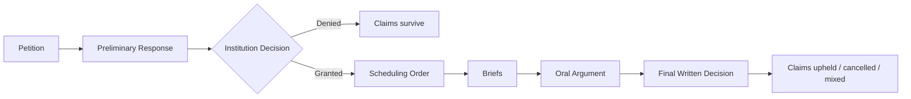
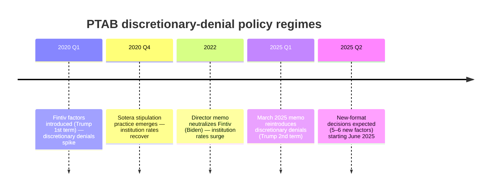

# ML-USPTO

Predicting **IPR (Inter Partes Review)** outcomes at the USPTO Patent Trial and Appeal Board (PTAB), using the PTAB API and guidance from a practicing patent attorney.

This README is the running glossary and high-level map of the domain. Deeper notes live in [`exploration/domain_notes.md`](exploration/domain_notes.md).

---

## 1. What is an IPR?

An **Inter Partes Review** is an administrative proceeding at the PTAB where a petitioner (typically a defendant being sued for infringement) asks the USPTO to cancel claims of an issued patent on prior-art grounds. Filing costs a client roughly **$150K–$250K**, so whether to file is a high-stakes decision we want to inform.

The case record follows a consistent ordering:

The **institution decision** is the first major gate. A denial is effectively a "claims survive" outcome for the patent owner, so the institution stage is baked into the final-outcome label we're predicting.

### Typical timeline

IPR timing is statutory (35 U.S.C. §§ 314, 316). End-to-end a case runs **~18 months** from petition to Final Written Decision, with two hard gates: institution (~6 months in) and FWD (≤12 months post-institution, extendable 6 months for good cause).

```mermaid
gantt
    title Typical IPR timeline (months from petition filing)
    dateFormat  X
    axisFormat  %s

    section Pre-institution
    Petition filed                      :milestone, m1, 0, 0
    Patent Owner Preliminary Response   :a1, 0, 3
    Institution decision window         :a2, 3, 6
    Institution decision                :milestone, m2, 6, 0

    section Trial (if instituted)
    Patent Owner Response               :b1, 6, 9
    Petitioner Reply                    :b2, 9, 12
    Patent Owner Sur-reply              :b3, 12, 13
    Oral hearing                        :milestone, m3, 15, 0
    Final Written Decision              :milestone, m4, 18, 0
```

Practical implication for modeling: the prediction target is the **trial outcome** (month ~18). Features sourced at petition time (month 0) support earliest prediction; features extracted from the institution decision (month 6) can only be used for post-institution predictions. The institution event is a *feature* / intermediate signal, not a target.

---

## 2. Target Variable

**IPR trial outcome** — exclusively. What happens at the end of the trial (claims upheld, claims cancelled, settled, terminated, …), derived from `trial_status` / `trial_outcome` on the proceedings record. Binary vs. multi-class framing, and how to treat settlements/terminations, is still TBD.

The institution decision is **not** a target. It is an intermediate event on the path to the trial outcome — a petition that fails institution is effectively a "claims survive" outcome for the patent owner, so the institution gate is absorbed into the trial-outcome label. Institution-stage signals (Fintiv, 325(d), Sotera, the decision text itself) are used as *features*.

---

## 3. Glossary

| Term | Definition |
|---|---|
| **PTAB** | Patent Trial and Appeal Board — the USPTO tribunal that hears IPRs. |
| **IPR** | Inter Partes Review — the proceeding itself. |
| **Petitioner** | Party challenging the patent (usually an accused infringer). |
| **Patent Owner** | Party defending the patent. |
| **Institution decision** | PTAB's grant/deny of the petition; the gatekeeping ruling. |
| **Final Written Decision (FWD)** | PTAB's ruling on the merits after trial. |
| **Fintiv factors** | Six discretionary-denial factors the PTAB uses to decide whether to institute when parallel district-court litigation exists. |
| **325(d)** | Statutory basis for discretionary denial when the same/substantially-similar prior art was already considered during original prosecution. |
| **Sotera stipulation** | Petitioner's commitment to not re-raise its PTAB invalidity grounds in district court — mitigates Fintiv. |
| **Dispositive factor** | The Fintiv factor that actually drove a given outcome. |
| **Technology Center / Group Art Unit** | USPTO's internal categorization of patents by technology domain. |
| **Discretionary denial** | A denial based on procedural / policy grounds (Fintiv, 325(d), etc.) rather than the merits of the prior art. |

---

## 4. Fintiv Factors (Ordinal Scale)

Judges rate each of the six Fintiv factors on a consistent 5-point ordinal scale, using predictable phrasing visible in the decision text:

1. heavily favors institution
2. favors institution
3. neutral
4. weighs against institution
5. heavily weighs against institution

Named factors include: grant of stay, trial date proximity, parallel proceedings, expert reliance, prior adjudication, and others. Decisions have explicit per-factor headings ("factor one", "factor two", …), so extraction via term search or LLM classification is tractable.

---

## 5. Policy Regimes (Temporal Macro Signal)

Institution rates swing with USPTO director appointments. The filing date effectively encodes which regime a petition was decided under, and this is expected to be the **strongest macro predictor**.

Practitioner view: *"March 2025 is exactly like March 2020."* Expected cycle is policy change → panic → rate dip → practitioner adaptation → recovery → eventual reversal.

---

## 6. Feature Families

In rough priority order for feature engineering:

1. **Binary flags** — Fintiv addressed, 325(d) addressed, Sotera stipulation filed
2. **Ordinal Fintiv sub-factor ratings** — 5-point scale per sub-factor
3. **Temporal / regime** — filing date, policy-era indicator
4. **Metadata** — technology center, patent age, counsel identity
5. **Document-structural** — discretionary-denial section length, prior-art count
6. **Dispositive factor** — which Fintiv factor drove the outcome

Extraction notes live in `exploration/domain_notes.md`.

---

## 7. Data Notes (quick pointers)

- Only a subset of institution decisions address Fintiv — the rest should be filtered out for Fintiv-specific modeling.
- The practitioner maintains an annotated spreadsheet with labeled Fintiv sub-factors — candidate training/validation labels.
- The institution decision alone is sufficient for discretionary-denial classification; full record is needed for substantive / prior-art analysis.
- Some features (Sotera stipulation, parallel-litigation status) require cross-referencing district-court data (e.g., Docket Navigator) — **not** in the PTAB API.

---

## 8. Related Files

- [`docs/`](docs/) — technical documentation (start here for API ↔ feature mapping)
- [`exploration/domain_notes.md`](exploration/domain_notes.md) — full domain notes from practitioner calls
- [`exploration/proceedings.md`](exploration/proceedings.md) — PTAB API proceedings-schema notes
- `src/exploration.py` — exploratory code
