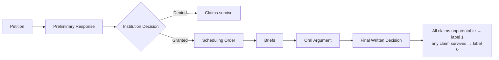
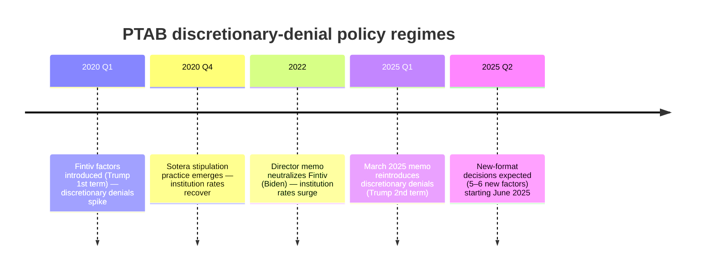

# ML-USPTO

Predicting **IPR (Inter Partes Review)** outcomes at the USPTO Patent Trial and Appeal Board (PTAB), using the PTAB API and guidance from a practicing patent attorney.

This README is the running glossary and high-level map of the domain. Deeper notes live in [`docs/scope/domain_notes.md`](docs/scope/domain_notes.md).

---

## 1. What is an IPR?

An **Inter Partes Review** is an administrative proceeding at the PTAB where a petitioner (typically a defendant being sued for infringement) asks the USPTO to cancel claims of an issued patent on prior-art grounds. Filing costs a client roughly **$150K–$250K**, so whether to file is a high-stakes decision we want to inform.

The case record follows a consistent ordering:

The **institution decision** is the first major gate. A denial is effectively a "claims survive" outcome for the patent owner, so the institution stage is baked into the final-outcome label we're predicting.

### Typical timeline

IPR timing is statutory (35 U.S.C. §§ 314, 316). End-to-end a case runs **~18 months** from petition to Final Written Decision, with two hard gates: institution (~6 months in) and FWD (≤12 months post-institution, extendable 6 months for good cause).

```mermaid
gantt
    title Typical IPR timeline (months from petition filing)
    dateFormat  X
    axisFormat  %s

    section Pre-institution
    Petition filed                      :milestone, m1, 0, 0
    Patent Owner Preliminary Response   :a1, 0, 3
    Institution decision window         :a2, 3, 6
    Institution decision                :milestone, m2, 6, 0

    section Trial (if instituted)
    Patent Owner Response               :b1, 6, 9
    Petitioner Reply                    :b2, 9, 12
    Patent Owner Sur-reply              :b3, 12, 13
    Oral hearing                        :milestone, m3, 15, 0
    Final Written Decision              :milestone, m4, 18, 0
```

Practical implication for modeling: we predict the **trial outcome** (month ~18) at **T₀ = petition filing** (month 0). Single-stage — no separate "institution decision" model. Every feature must be observable at T₀ or earlier; institution decisions, POPRs, FWDs and everything else after month 0 leak the label and are excluded as features. See `docs/scope/prediction_scope.md` §4 for the full leakage rule.

---

## 2. Target Variable

**IPR trial outcome** — exclusively. **Binary**: `1` = the patent owner lost (a Final Written Decision held all challenged claims unpatentable); `0` = anything else (institution denied, discretionary denial, settled before FWD, terminated procedurally, or FWD where any claim survived). The label is built from `trial_status` and decision-row outcome fields per the taxonomy in [`config/labels.yaml`](config/labels.yaml); see [`docs/scope/prediction_scope.md`](docs/scope/prediction_scope.md) §3 for the full rationale.

The institution decision is **not** a separate target. A petition that fails institution is effectively a "claims survive" outcome for the patent owner, so the institution gate is absorbed into the trial-outcome label as `0`. The institution decision itself is post-T₀ — its text is **not** a feature source. The Fintiv / 325(d) / Sotera signals we use come from the petitioner's framing in petition §IV (advocacy at T₀), not from the judge's later ruling.

---

## 3. Glossary

| Term | Definition |
|---|---|
| **PTAB** | Patent Trial and Appeal Board — the USPTO tribunal that hears IPRs. |
| **IPR** | Inter Partes Review — the proceeding itself. |
| **Petitioner** | Party challenging the patent (usually an accused infringer). |
| **Patent Owner** | Party defending the patent. |
| **Institution decision** | PTAB's grant/deny of the petition; the gatekeeping ruling. |
| **Final Written Decision (FWD)** | PTAB's ruling on the merits after trial. |
| **Fintiv factors** | Six discretionary-denial factors the PTAB uses to decide whether to institute when parallel district-court litigation exists. |
| **325(d)** | Statutory basis for discretionary denial when the same/substantially-similar prior art was already considered during original prosecution. |
| **Sotera stipulation** | Petitioner's commitment to not re-raise its PTAB invalidity grounds in district court — mitigates Fintiv. |
| **Dispositive factor** | The Fintiv factor that actually drove a given outcome. *Context only — extracted from the post-T₀ institution decision and not used as a feature.* |
| **Technology Center / Group Art Unit** | USPTO's internal categorization of patents by technology domain. |
| **Discretionary denial** | A denial based on procedural / policy grounds (Fintiv, 325(d), etc.) rather than the merits of the prior art. |

---

## 4. Fintiv Factors — context only, not a feature source

Judges rate each of the six Fintiv factors on a consistent 5-point ordinal scale (heavily favors → heavily weighs against institution) in the institution decision. The decision is post-T₀, so **we do not read it**. Per `docs/scope/prediction_scope.md` §8.2 we extract only the petitioner's preemptive Fintiv framing from petition §IV (sales pitch, not ruling) — most usefully whether a Sotera stipulation is offered, since that's a binding commitment rather than rhetoric. The judge's actual factor-by-factor ruling stays available for evaluation / sanity-check, never as a feature.

---

## 5. Policy Regimes (Temporal Macro Signal)

Institution rates swing with USPTO director appointments. The filing date effectively encodes which regime a petition was decided under, and this is expected to be the **strongest macro predictor**.

Practitioner view: *"March 2025 is exactly like March 2020."* Expected cycle is policy change → panic → rate dip → practitioner adaptation → recovery → eventual reversal.

---

## 6. Feature Families

All features must be observable at T₀ (petition filing). In rough priority order:

1. **Petition-text binary flags** — Fintiv addressed in §IV, 325(d) addressed, Sotera stipulation offered
2. **Petition-text counts** — claims challenged, prior-art references, exhibits, expert declarations, grounds (102/103)
3. **Temporal / regime** — filing date, policy-era indicator
4. **Patent metadata** — technology center, patent age, CPC codes, NPE flag (from assignment chain)
5. **Prosecution history** — office-action count, PTA, family size — all T₀-filtered (no `TRIAL*` events, no post-T₀ dates)
6. **Time-correct base rates** — art-unit / tech-center cancellation rates over trials with terminating FWDs strictly before T₀

The full per-feature catalog and tier demotions live in [`docs/features/admissible_documents_analysis.md`](docs/features/admissible_documents_analysis.md). The leakage rule and disallowed sources live in [`docs/scope/prediction_scope.md`](docs/scope/prediction_scope.md) §4.

---

## 7. Data Notes (quick pointers)

- The petition PDF is the **only** text source we read — every other admissible document is skipped (see `docs/scope/prediction_scope.md` §8.1). Net text-storage corpus-wide: ~4–5 GB.
- Patent-side enrichment comes from the file-wrapper bulk products (`PASDL`, `PTMNFEE2`, `PTFWPRE`) — see `docs/scope/prediction_scope.md` §5.3.
- District-court signals (parallel-litigation forum, jury date, Sotera stipulation) are extracted from the petition's §IV / §VI.B restatements — no external Docket Navigator lookup needed.
- Pre-2022 trials use the legacy `Paper` document category; post-2022 use `PETITION`. The petition picker handles both — see `docs/api/proceedings.md`.

---

## 8. Related Files

- [`docs/`](docs/) — technical documentation (start here for API ↔ feature mapping)
- [`docs/scope/prediction_scope.md`](docs/scope/prediction_scope.md) — what we predict, T₀ leakage rule, label taxonomy
- [`docs/scope/domain_notes.md`](docs/scope/domain_notes.md) — full domain notes from practitioner calls
- [`docs/api/proceedings.md`](docs/api/proceedings.md) — PTAB API proceedings-schema notes
- [`docs/plans/2026-04-27-ingestion-pipeline.md`](docs/plans/2026-04-27-ingestion-pipeline.md) — six-stage ingestion plan
- [`src/ml_uspto/`](src/ml_uspto/) — package source (`clients/`, `parse/`, `ingest/`, `schemas/`, `paths.py`)
