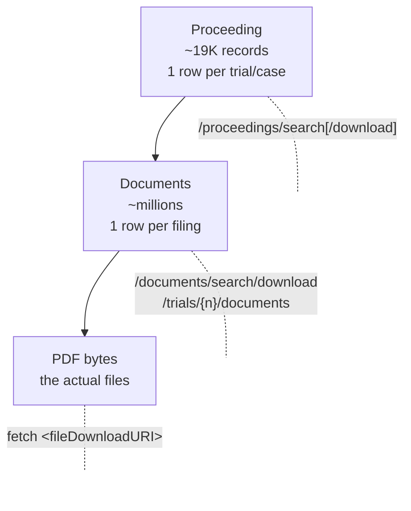

# API ↔ Feature Map

A cross-reference between the USPTO PTAB endpoints and the feature families we care about. Use this as a quick map when designing extraction: *for feature X, which endpoint do I hit?*

> **Scope note.** Feature inclusion is governed by `../scope/prediction_scope.md` §4 (the T₀ leakage rule) and §8 (modeling assumptions, especially the petition-only PDF policy). This doc is authoritative on *which endpoint returns what*; `../scope/prediction_scope.md` is authoritative on *what we're allowed to use*. Where the two appear to disagree, scope wins.

Client code: `src/data/client.py`. Normalized schemas: `proceedings.md`.

**Authoritative API references**:
- Swagger UI / OpenAPI spec: <https://data.uspto.gov/swagger/index.html> — endpoint paths, request parameters, response body schemas.
- Query syntax reference: `ODP-API-Query-Spec.pdf` (in this directory).
- Empirical-probing note: per `feedback_empirical_over_spec` memory, prefer hitting endpoints with the live client to confirm real response shape before coding to the spec — Swagger examples include synthetic placeholder data.

---

## 1. Endpoints available

| Endpoint | Method in `USPTOClient` | Returns | Primary use |
|---|---|---|---|
| `GET /trials/proceedings/search` | `search_proceedings()` | Paginated list of proceedings (trial metadata) | Simple keyword search |
| `POST /trials/proceedings/search` | `search_proceedings_post()` | Same as GET but accepts structured `filters`, `rangeFilters`, `fields`, `facets`, `sort` | **Primary ingestion path** — target-variable source, surgical date/type slicing, facet exploration |
| `GET /trials/proceedings/search/download` | *(not wrapped)* | CSV or JSON file attachment of proceeding-level metadata (one row per case) | Bulk metadata export when you want all ~19K proceedings as a single file instead of paginating `/search`. **Empirically returns 403 'Forbidden' under load** while `/search` and path-style endpoints continue to work — see download-bucket caveat below. |
| `GET /trials/proceedings/{trial_number}` | `get_proceeding()` | Single proceeding's full record. Includes `trialMetaData.fileDownloadURI` → **whole-case ZIP of every filing's PDF**. | Detailed per-case metadata lookup; also the entry point for whole-docket bulk pulls. |
| `GET /trials/decisions/search` | `search_decisions()` | Paginated list of decisions | Simple keyword search |
| `POST /trials/decisions/search` | `search_decisions_post()` | Structured decision metadata + a **500-char OCR preview** (`documentData.documentOCRText`). Full decision text is **not** returned. | **Primary path for structured decision signals** — `decisionData.statuteAndRuleBag`, `issueTypeBag`, `trialOutcomeCategory`, `appealOutcomeCategory`. For full text (Fintiv factor ratings, dispositive factor) you must fetch the decision PDF via `fileDownloadURI`. |
| `POST /trials/decisions/search/download` | `download_decisions()` | CSV or JSON file attachment of decision metadata | Fast tabular export; **restricted field projection** — rejects `documentOCRText`, `fileDownloadURI`, `appealOutcomeCategory` |
| `GET /trials/{trial_number}/documents` | `get_trial_documents()` | Full filing list for a trial (petition, POPR, institution decision, briefs, FWD, …) | Per-trial document index — still needed for petition / POPR text (which is *not* in the decisions endpoint response) |
| `GET /trials/documents/search/download` | *(not wrapped, inferred — not yet probed)* | Cross-trial filing-level metadata as CSV/JSON. One row per filing with `documentTypeName`, `documentFilingDate`, `fileDownloadURI`. | Bulk filing-index for "find all institution decisions / all petitions across the whole corpus" without per-trial calls. **Schema not yet empirically verified.** |
| `GET <trialMetaData.fileDownloadURI>` | *(not wrapped)* | Whole-case ZIP of every filing's PDF. Probed on IPR2026-00339: 33 PDFs / 202 MB. | Per-proceeding bulk PDF pull. Use targeted single-PDF fetches (via `documentData.fileDownloadURI`) over this when you only need decision PDFs — naive whole-case zips × 18K cases ≈ multi-TB. |

All `/trials/*` calls above fall in the **metadata retrieval bucket** (5M calls/week combined, serial-only, burst=1). See `rate_limits.md` for full constraints.

> ⚠ **`/search/download` endpoints sit in a stricter bucket than `/search`.** Empirically observed 2026-04-25: same key, same IP, same minute — `/proceedings/search/download?q=IPR2026-00339` returned `{"message":"Forbidden"}` (HTTP 403, AWS API Gateway-style body) while `/proceedings/search` and `/proceedings/{trial_number}` returned 200 fine. Swagger UI calls also kept working. Hypothesis: download endpoints are gated by a separate WAF/quota rule (possibly on caller fingerprint — Swagger sends `Origin: data.uspto.gov`). For ingestion at scale, prefer the paginated POST `/search` route over `/search/download` until this is diagnosed; or front the call with `Origin`/`Referer`/browser-`User-Agent` headers.

### The three-level data model

PTAB data is structured as a one-to-many hierarchy. Every download endpoint exports metadata at one of these levels — choosing the right one is about granularity, not filtering:

**Same trial number filter, three different return shapes:**

| Call | Rows for IPR2026-00339 | Each row represents |
|---|---:|---|
| `/proceedings/search/download?q=IPR2026-00339` | 1 | the case (header) |
| `/documents/search/download?q=IPR2026-00339` *(inferred)* | ~33 | one filing in the case |
| `/decisions/search/download?q=IPR2026-00339` | 0–N | one decision-type filing |
| `GET <trialMetaData.fileDownloadURI>` | (binary) | every PDF in the case, zipped |

Filtering changes *how many* rows match; granularity determines *what each row is*. The endpoints are **complementary tables joined on `trialNumber`**, not interchangeable views — pick by what each row should mean.

### Two distinct `fileDownloadURI` fields

The same field name appears at two granularities and means different things — easy to confuse:

| Source | What it points to | Size |
|---|---|---|
| `trialMetaData.fileDownloadURI` (on a proceeding record) | **Whole-case ZIP** of every filing's PDF | ~50–500 MB per case (probed: 202 MB / 33 PDFs for IPR2026-00339) |
| `documentData.fileDownloadURI` (on a document or decision record) | **Single PDF** of one specific filing | ~0.5–25 MB per file |

Both are direct downloads via the authenticated session (`X-API-Key`). Reuse `client.session.get(uri)` rather than building a fresh request. The whole-case zip is *not* what `/search/download` returns — that endpoint exports search-result metadata as a CSV/JSON file and contains zero PDF content.

> ⚠ **`documentOCRText` is a 500-char preview, not the full text.** Confirmed empirically 2026-04-24: every endpoint that returns `documentOCRText` (decisions search, documents endpoint, per-document detail endpoints) caps it at 500 characters — enough for the case caption and judge names, nothing substantive. For full decision text you must fetch the PDF via `documentData.fileDownloadURI`. This is a global API behavior, not a `fields`-projection artifact.

> ⚠ **Naming collision:** the ODP catalog also exposes `/api/v1/petition/decisions/*` ("Petition Decision Search"). This is **not** PTAB data — it is the USPTO Office of Petitions' rulings on procedural prosecution matters (PPH requests, PTA disputes, abandonment revivals). Wrong corpus for this project. Telltale: `finalDecidingOfficeName: "OFFICE OF PETITIONS"` in the record. See `../scope/ptab_scope_and_terminology.md` §3.

### Decisions vs. documents — overlap, not duplication

The decisions and documents endpoints return **the same physical papers** for the decision-type subset. Confirmed empirically on `IPR2022-01002`: the 3 records from `/trials/decisions/search` have identical `documentIdentifier`s to 3 of the 145 records from `/trials/{trial}/documents`. Same PDFs, same OCR text.

| | `/trials/{trial}/documents` | `/trials/decisions/search` |
|---|---|---|
| Scope | Per-trial, **all papers** (petitions, POPRs, exhibits, orders, decisions, …) | Cross-trial, **decision papers only** |
| Query | GET, `{trial}` in path | POST with full Simplified Query Syntax |
| Extra fields | None — documents only | **`decisionData.{trialOutcomeCategory, decisionTypeCategory, issueTypeBag, statuteAndRuleBag, appealOutcomeCategory}`** |
| OCR reliability | Inconsistent (observed 3/25 populated); **500-char preview** when present | Reliable when requested via `fields`, but **capped at 500 chars** (preview, not full text) |

Conceptually the decisions endpoint is a filtered+enriched view over the decision-type subset of documents. To avoid duplicate ingestion, pick a path per use case rather than calling both for the same trial:

- **Decision text + outcome labels (cross-trial)** → decisions POST only.
- **Petitions / POPRs / exhibits / full timeline (per-trial)** → documents endpoint; strip or skip decision-type papers if already ingested.
- **Both at scale** → decisions POST first (cross-trial), then per-trial documents calls filtered to `trialDocumentCategory != "Decision"`.

### POST Simplified Query Syntax — key notes

- Field names use **dotted paths**: `trialMetaData.trialTypeCode`, `patentOwnerData.patentNumber`, `decisionData.issueTypeBag`.
- `filters` (exact-match list) and `rangeFilters` (date/number inclusive ranges) are the primary slicing tools. Example: `trialMetaData.trialTypeCode = IPR` + `petitionFilingDate ∈ [2023-01-01, 2023-03-31]`.
- `fields` trims the response payload; wildcards and parent fields (implies all children) are supported. Invalid field names are **silently ignored**, so verify by reading the response.
- `facets` returns aggregated counts — used for cheap distribution sanity checks without iterating records.
- Full syntax reference: `ODP-API-Query-Spec.pdf`.

### Observed counts (probed 2026-04-24)

- 19,246 proceedings total: **IPR 18,058, CBM 602, PGR 558, DER 28**.
- Proceeding status distribution (the label space): *Institution Denied* 6,015; *Final Written Decision* 5,838; *Terminated-Settled* 4,408; *Terminated* 933; *Discretionary Denial* 661; *FWD – Appealed* 591; *Trial Instituted* 351; others small.

---

## 2. Feature → Endpoint map

> Feature inclusion is gated by `../scope/prediction_scope.md` §4 / §8. Rows below marked "label-only" or "out of scope" are accessible via the API but disallowed as features under the current scope; they're listed here so the endpoint surface stays complete.

| # | Feature family | Specific feature | Endpoint | Source field / derivation | Status under prediction_scope |
|---|---|---|---|---|---|
| — | **Target** | Trial outcome | proceedings POST | `trialMetaData.trialStatusCategory` | Label |
| — | **Target** | Decision-level outcome | decisions POST | `decisionData.trialOutcomeCategory`, `decisionData.appealOutcomeCategory` | Label only — terminating FWD per §3 |
| 1 | Petition-text | Fintiv addressed (Y/N) | **petition PDF** | Petition §IV header presence | **In scope.** Petition-only per §8.1; replaces the decision-PDF path. |
| 1 | Petition-text | Sotera stipulation present | **petition PDF** | Petition §IV.4 phrase match ("will not pursue" / "stipulate") | **In scope.** Extractable from petition (corrects earlier "external" framing). |
| 1 | Petition-text | Statute grounds asserted (102/103/112) | **petition PDF** | Petition §I.B grounds table | **In scope.** |
| 1 | Petition-text | n_challenged_claims, n_grounds, n_prior_art_references | **petition PDF** | §I.B + exhibit list | **In scope.** Full feature catalog: `../features/admissible_documents_analysis.md` §2.6. |
| 2 | Decision-side structured | `statuteAndRuleBag` (e.g. `35 USC 325` for 325(d)) | decisions POST | `decisionData.statuteAndRuleBag` | **Out of scope as feature** (§4 leakage). Available for label-set debugging only. |
| 2 | Decision-side structured | `issueTypeBag` (102/103/112 actually addressed by judges) | decisions POST | `decisionData.issueTypeBag` | **Out of scope as feature** (§4 leakage). Useful for evaluating extraction accuracy of feature 1 above. |
| 2 | Decision PDF text | Fintiv factor ratings, dispositive factor | decision PDF | Full text → LLM/regex over per-factor headings | **Out of scope** (§4 leakage). Available for ground-truth Fintiv labels in evaluation only — see `../scope/ptab_scope_and_terminology.md` §5.4. |
| 3 | Temporal / regime | Petition filing date (T₀ itself) | proceedings | `petition_filing_date`, `accorded_filing_date` | **In scope.** |
| 3 | Temporal / regime | Policy-era indicator | proceedings (derived) | Bucketed from `petition_filing_date` per regime table in `../scope/domain_notes.md` | **In scope.** Strong macro predictor. |
| 3 | Temporal / regime | Institution decision date | proceedings | `institution_decision_date` | **Out of scope** (§4 leakage). Listed for completeness. |
| 4 | Metadata | Technology center / group art unit | proceedings | `technology_center`, `group_art_unit` | **In scope.** |
| 4 | Metadata | Patent age at petition | proceedings (derived) | `petition_filing_date` − `grant_date` | **In scope.** |
| 4 | Metadata | Counsel identity (petitioner / owner) | proceedings + petition | `petitioner_counsel`, `owner_counsel`; richer detail from petition §VI.C | **In scope.** Free text — needs normalization. |
| 4 | Metadata | Real parties in interest | proceedings + petition §VI.A | `petitioner_real_party`, `owner_real_party` (proceedings often truncates to lead petitioner — petition §VI.A is authoritative) | **In scope.** |
| 5 | Petition-text structural | Petition word count + utilization | **petition PDF** | §42.24 certification footer | **In scope.** |
| 5 | Petition-text structural | Prior-art reference count + classification | **petition PDF** | Petition exhibit list | **In scope.** Full taxonomy in `../features/admissible_documents_analysis.md` §6.1. |

---

## 3. What the API does *not* give us

Features that previously needed external sources — but in our scope are recovered from the petition itself:

- **Sotera stipulation** — extracted from petition §IV.4 (phrase match on "will not pursue" / "stipulate" / "agree not to assert"). Earlier drafts flagged this as needing district-court data; it's actually in the petition because the petitioner has every incentive to feature it prominently. See `../scope/ptab_scope_and_terminology.md` §5.
- **Parallel-litigation status / trial date proximity** — extracted from petition §IV.2 (Fintiv factor 2 narrative cites the actual jury date and district-court schedule). Lower precision than parsing court records directly, but no extra data source needed. See `../scope/prediction_scope.md` §8.3.

Genuinely missing from a petition-only pipeline:

- **PTAB's internal Fintiv ratings** — only available in the Institution Decision text, which is post-T₀ and excluded by §4. Ground-truth labels for evaluation only.
- **District-court docket congestion / judge-level statistics** — would enrich Fintiv factor 3 but require PACER or Docket Navigator. Out of scope for v1.

---

## 4. Typical extraction path per feature type

- **Structured metadata** → `search_proceedings_post()` with `filters` on `trialMetaData.trialTypeCode` and `rangeFilters` on `petitionFilingDate`, trimmed via `fields`.
- **Petition-text features** (Fintiv, Sotera, grounds, claims, exhibits) → `get_trial_documents()` → filter to petition (`documentNumber == 3` or type "Petition") → fetch PDF via `documentData.fileDownloadURI` → OCR/text-parse with regex on `§` anchors.
- **Target labels** → `search_decisions_post()` reading `decisionData.trialOutcomeCategory` + `decisionIssueDate` for the terminating FWD; structured fields like `statuteAndRuleBag` / `issueTypeBag` are *available* but disallowed as features per `../scope/prediction_scope.md` §4.
- **Tabular CSV export** (for external analysis only) → `download_decisions()` with `format="csv"`. Restricted fields — don't request OCR or appeal fields here.

## 5. Cost model

For the operational cost model under the petition-only scope, see **`../scope/prediction_scope.md` §5.4** (canonical). The earlier table here that estimated ~25K decision PDFs and 50–90 GB of petition storage assumed a richer pipeline that has since been cut — consult the scope doc for current numbers.
