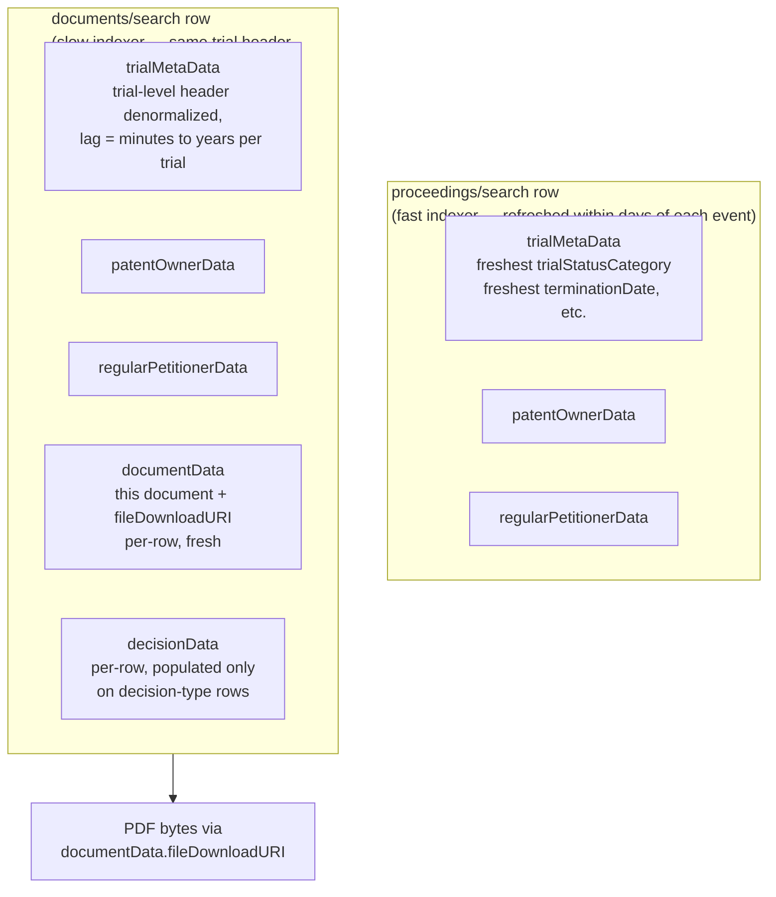

# API ↔ Feature Map

A cross-reference between the USPTO PTAB endpoints and the feature families we care about. Use this as a quick map when designing extraction: *for feature X, which endpoint do I hit?*

> **Scope note.** Feature inclusion is governed by `../scope/prediction_scope.md` §4 (the T₀ leakage rule) and §8 (modeling assumptions, especially the petition-only PDF policy). This doc is authoritative on *which endpoint returns what*; `../scope/prediction_scope.md` is authoritative on *what we're allowed to use*. Where the two appear to disagree, scope wins.

Client code: `src/data/client.py`. The proceedings endpoint and the documents/search endpoint serve **complementary** roles — see `proceedings.md` for the live-vs-frozen distinction.

**Authoritative API references**:
- Swagger UI / OpenAPI spec: <https://data.uspto.gov/swagger/index.html> — endpoint paths, request parameters, response body schemas.
- Query syntax reference: `ODP-API-Query-Spec.pdf` (in this directory).
- Empirical-probing note: per `feedback_empirical_over_spec` memory, prefer hitting endpoints with the live client to confirm real response shape before coding to the spec — Swagger examples include synthetic placeholder data.

---

## 1. Endpoints available

> **Proceedings and documents serve complementary roles.** Proceedings holds the freshest trial-level state (current status, terminationDate, etc.). Documents/search returns one row per filing — the document-specific data (`documentData`, and per-row `decisionData` on decision rows) is unique to each row, but the `trialMetaData` block is the trial-level header **denormalized at indexing time** and refreshed by a *separate, slower* indexer. There is no T₀-frozen view of the trial in either endpoint — pull all `trialMetaData` features from `proceedings/search`, and treat document-row `trialMetaData` as off-limits for features. See `proceedings.md` "What we observed" for the empirical lag table.

| Endpoint | Method in `USPTOClient` | Returns | Primary use |
|---|---|---|---|
| `POST /trials/proceedings/search` | `search_proceedings_post()` | One row per trial with the freshest trial / patent / party blocks. | **Primary source for both features and label.** Static fields (patent, parties, art unit, dates ≤ T₀) → features. Mutable fields (`trialStatusCategory`, `terminationDate`, `institutionDecisionDate`, `latestDecisionDate`) → label only. |
| `POST /trials/documents/search` | *(client method TBD — `search_documents_post()`)* | Cross-trial document records. Each row carries `documentData` (per-row, including PDF link), `decisionData` (per-row, populated only on decision-type rows), and `trialMetaData` (trial-level, denormalized — lagged vs proceedings). | **Petition PDF URI + per-row decisionData.** Filter by `trialNumber` → use `pick_petition()` → read only `documentData.*` from the petition row. Filter to `"FINAL"` → label rows with populated `decisionData`. *Do not* use `trialMetaData` from this endpoint as a feature. |
| `POST /trials/decisions/search` | `search_decisions_post()` | Structured decision metadata + a **500-char OCR preview** (`documentData.documentOCRText`). Full decision text is **not** returned. | Alternative label-assembly path when you want decision rows directly. Equivalent to documents/search filtered to decision categories, but pre-filtered by the API. |
| `POST /trials/decisions/search/download` | `download_decisions()` | CSV or JSON file attachment of decision metadata | Fast tabular export of decisions only; **restricted field projection** — rejects `documentOCRText`, `fileDownloadURI`, `appealOutcomeCategory`. |
| `GET /trials/{trial_number}/documents` | `get_trial_documents()` | Full filing list for a trial (capped at 25 records, no pagination). | Per-trial deep dive during exploration. Not used at corpus scale due to the 25-record cap. |
| `GET <documentData.fileDownloadURI>` | *(not wrapped)* | Single PDF — typically the petition (~4 MB). | Per-document PDF fetch for petition-text feature extraction. |
| `GET <trialMetaData.fileDownloadURI>` | *(not wrapped)* | Whole-case ZIP of every filing's PDF (~50–500 MB / case). | Reserved for one-off deep dives. Not used at corpus scale. |
| `GET /trials/proceedings/{trial_number}` | `get_proceeding()` | Single proceeding's full record + whole-case `trialMetaData.fileDownloadURI`. | Use when you need the whole-case ZIP URI for one specific trial. |

All `/trials/*` calls above fall in the **metadata retrieval bucket** (5M calls/week combined, serial-only, burst=1). See `rate_limits.md` for full constraints.

> ⚠ **GET vs POST.** `/trials/documents/search` and `/trials/decisions/search` are **POST-only** — GET returns 404. Same is *not* true of `/trials/proceedings/search` (both methods work; POST is the structured-query form).

> ⚠ **`/search/download` endpoints sit in a stricter bucket than `/search`.** Empirically observed 2026-04-25: same key, same IP, same minute — `/proceedings/search/download?q=IPR2026-00339` returned `{"message":"Forbidden"}` (HTTP 403) while `/proceedings/search` and path-style endpoints returned 200. For ingestion at scale, prefer the paginated POST `/search` route over `/search/download` until this is diagnosed.

> ⚠ **`documentTypeName` is unindexed.** Empirical (2026-04-26): filtering or faceting on `documentData.documentTypeName` returns empty. Use `documentData.documentCategory` (case-insensitive — `"PETITION"` and `"Petition"` both work).

### The data model — denormalized, with two indexer cadences

PTAB data is conceptually a one-to-many hierarchy (Trial → Documents → PDF bytes). The API exposes it through two endpoints that differ on **indexer cadence**, not on schema:

**Implication for the leakage rule.** Neither endpoint returns a T₀-frozen view. Both return a "current snapshot" of `trialMetaData` from their respective indexers, which differ in how stale they are. The proceedings row is fresher and is the canonical source for both features (static / pre-T₀ fields only) and label (mutable post-T₀ fields). The documents row's `trialMetaData` is *also* live state, just lagged — never assume it's T₀-frozen. Per-row fields on the documents row (`documentData`, `decisionData`) are fresh and unique to each filing — those are the documents endpoint's actual value.

**Same trial number filter, multiple return shapes:**

| Call | Rows for one trial | Each row represents |
|---|---:|---|
| `/proceedings/search` | 1 | the case (header), freshest state |
| `/documents/search` filter `documentCategory: PETITION` | 1 (typically) | the petition filing — `documentData` is fresh, `trialMetaData` is lagged |
| `/documents/search` filter `documentCategory: FINAL` | 0–N | terminating-FWD rows with populated `decisionData` |
| `/documents/search` no document filter | ~30–150 | one filing per row |
| `/decisions/search` | 0–N | one decision-type filing (filtered subset of documents/search) |
| `GET <trialMetaData.fileDownloadURI>` | (binary) | every PDF in the case, zipped |

### Two distinct `fileDownloadURI` fields

The same field name appears at two granularities and means different things — easy to confuse:

| Source | What it points to | Size |
|---|---|---|
| `trialMetaData.fileDownloadURI` (on a proceeding record) | **Whole-case ZIP** of every filing's PDF | ~50–500 MB per case (probed: 202 MB / 33 PDFs for IPR2026-00339) |
| `documentData.fileDownloadURI` (on a document or decision record) | **Single PDF** of one specific filing | ~0.5–25 MB per file |

Both are direct downloads via the authenticated session (`X-API-Key`). Reuse `client.session.get(uri)` rather than building a fresh request. The whole-case zip is *not* what `/search/download` returns — that endpoint exports search-result metadata as a CSV/JSON file and contains zero PDF content.

> ⚠ **`documentOCRText` is a 500-char preview, not the full text.** Confirmed empirically 2026-04-24: every endpoint that returns `documentOCRText` (decisions search, documents endpoint, per-document detail endpoints) caps it at 500 characters — enough for the case caption and judge names, nothing substantive. For full decision text you must fetch the PDF via `documentData.fileDownloadURI`. This is a global API behavior, not a `fields`-projection artifact.

> ⚠ **Naming collision:** the ODP catalog also exposes `/api/v1/petition/decisions/*` ("Petition Decision Search"). This is **not** PTAB data — it is the USPTO Office of Petitions' rulings on procedural prosecution matters (PPH requests, PTA disputes, abandonment revivals). Wrong corpus for this project. Telltale: `finalDecidingOfficeName: "OFFICE OF PETITIONS"` in the record. See `../scope/ptab_scope_and_terminology.md` §3.

### Decisions vs. documents — overlap, not duplication

The decisions endpoint is a **filtered subset of documents/search**, restricted to decision-type rows. Confirmed empirically on `IPR2022-01002`: the 3 records from `/trials/decisions/search` have identical `documentIdentifier`s to 3 of the 145 records from `/trials/{trial}/documents` — same PDFs, same OCR text. The cross-trial `/trials/documents/search` carries `decisionData` denormalized onto every row, so for label assembly you can either:

- **Pull labels from documents/search filtered to `documentCategory: "FINAL"`.** Each FWD-type row has its own populated `decisionData` block (`trialOutcomeCategory`, `issueTypeBag`, `statuteAndRuleBag`, `decisionIssueDate`). Note: `decisionData` is **per-row**, populated only on decision-type rows — it is `null` on the petition row, so you cannot get the label from the petition row directly.
- **Pull labels from decisions/search.** Cleaner if you only want decision rows and want to filter by `decisionIssueDate` ranges. Functionally equivalent to filtering documents/search to decision categories.
- **Pull labels from proceedings/search.** `trialMetaData.trialStatusCategory` carries the resolved label state directly (`Final Written Decision`, `Terminated-Settled`, `Institution Denied`, etc.) and is the freshest of the three sources. This is the path used by `ml_uspto.parse.preprocessing`.

### POST Simplified Query Syntax — key notes

- Field names use **dotted paths**: `trialMetaData.trialTypeCode`, `patentOwnerData.patentNumber`, `decisionData.issueTypeBag`.
- `filters` (exact-match list) and `rangeFilters` (date/number inclusive ranges) are the primary slicing tools. Example: `trialMetaData.trialTypeCode = IPR` + `petitionFilingDate ∈ [2023-01-01, 2023-03-31]`.
- `fields` trims the response payload; wildcards and parent fields (implies all children) are supported. Invalid field names are **silently ignored**, so verify by reading the response.
- `facets` returns aggregated counts — used for cheap distribution sanity checks without iterating records.
- Full syntax reference: `ODP-API-Query-Spec.pdf`.

### Observed counts (probed 2026-04-24)

- 19,246 proceedings total: **IPR 18,058, CBM 602, PGR 558, DER 28**.
- Proceeding status distribution (the label space): *Institution Denied* 6,015; *Final Written Decision* 5,838; *Terminated-Settled* 4,408; *Terminated* 933; *Discretionary Denial* 661; *FWD – Appealed* 591; *Trial Instituted* 351; others small.

---

## 2. Feature → Endpoint map

> Feature inclusion is gated by `../scope/prediction_scope.md` §4 / §8. Rows below marked "label-only" or "out of scope" are accessible via the API but disallowed as features under the current scope; they're listed here so the endpoint surface stays complete.

**Where each row of the model matrix comes from:**
- *Trial inventory + label* → `POST /trials/proceedings/search` (live trial state — canonical list of all 18K IPRs).
- *Petition PDF URI* → for each trial, `POST /trials/documents/search` filtered by `trialNumber`, then run the petition picker (see `proceedings.md`). Read only `documentData.*` from the picked row (`fileDownloadURI`, `documentFilingDate`, etc.). The `trialMetaData` block on this row is **lagged**, not frozen at T₀, and may carry post-T₀ values — pull all `trialMetaData` features from `proceedings/search` instead. The corpus-wide `documentCategory: "PETITION"` shortcut only catches ~6K of 18K trials — pre-2022 petitions live in the legacy `Paper` category.
- *Petition-text features* → fetch the PDF from `documentData.fileDownloadURI` on the picked row.

| # | Feature family | Specific feature | Endpoint | Source field / derivation | Status under prediction_scope |
|---|---|---|---|---|---|
| — | **Target** | Trial outcome | proceedings/search (live state) | `trialMetaData.trialStatusCategory` | Label |
| — | **Target** | Terminating-FWD outcome | documents/search filtered to `FINAL` | `decisionData.trialOutcomeCategory`, `decisionData.appealOutcomeCategory`, `decisionData.decisionIssueDate` | Label only — terminating FWD per §3 |
| 1 | Petition-text | Fintiv addressed (Y/N) | **petition PDF** | Petition §IV header presence | **In scope.** Petition-only per §8.1; replaces the decision-PDF path. |
| 1 | Petition-text | Sotera stipulation present | **petition PDF** | Petition §IV.4 phrase match ("will not pursue" / "stipulate") | **In scope.** Extractable from petition (corrects earlier "external" framing). |
| 1 | Petition-text | Statute grounds asserted (102/103/112) | **petition PDF** | Petition §I.B grounds table | **In scope.** |
| 1 | Petition-text | n_challenged_claims, n_grounds, n_prior_art_references | **petition PDF** | §I.B + exhibit list | **In scope.** Full feature catalog: `../features/admissible_documents_analysis.md` §2.6. |
| 2 | Decision-side structured | `statuteAndRuleBag` (e.g. `35 USC 325` for 325(d)) | documents/search filtered to `FINAL` (or decisions POST) | `decisionData.statuteAndRuleBag` | **Out of scope as feature** (§4 leakage). Available for label-set debugging only. |
| 2 | Decision-side structured | `issueTypeBag` (102/103/112 actually addressed by judges) | documents/search filtered to `FINAL` (or decisions POST) | `decisionData.issueTypeBag` | **Out of scope as feature** (§4 leakage). Useful for evaluating extraction accuracy of feature 1 above. |
| 2 | Decision PDF text | Fintiv factor ratings, dispositive factor | decision PDF | Full text → LLM/regex over per-factor headings | **Out of scope** (§4 leakage). Available for ground-truth Fintiv labels in evaluation only — see `../scope/ptab_scope_and_terminology.md` §5.4. |
| 3 | Temporal / regime | Petition filing date (T₀ itself) | documents/search | `trialMetaData.petitionFilingDate`, `trialMetaData.accordedFilingDate` | **In scope.** |
| 3 | Temporal / regime | Policy-era indicator | documents/search (derived) | Bucketed from `petitionFilingDate` per regime table in `../scope/domain_notes.md` | **In scope.** Strong macro predictor. |
| 3 | Temporal / regime | Institution decision date | proceedings/search (live) | `trialMetaData.institutionDecisionDate` | **Out of scope** (§4 leakage). Strictly label-side; do not pull from any source as a feature. |
| 4 | Metadata | Technology center / group art unit | documents/search | `patentOwnerData.technologyCenterNumber`, `patentOwnerData.groupArtUnitNumber` | **In scope.** |
| 4 | Metadata | Patent age at petition | documents/search (derived) | `petitionFilingDate` − `patentOwnerData.grantDate` | **In scope.** |
| 4 | Metadata | Counsel identity (petitioner / owner) | documents/search + petition | `regularPetitionerData.counselName`, `patentOwnerData.counselName`; richer detail from petition §VI.C | **In scope.** Free text — needs normalization. |
| 4 | Metadata | Real parties in interest | documents/search + petition §VI.A | `regularPetitionerData.realPartyInInterestName`, `patentOwnerData.realPartyInInterestName`; the API field truncates joinder to the lead petitioner — petition §VI.A is authoritative | **In scope.** |
| 5 | Petition-text structural | Petition word count + utilization | **petition PDF** | §42.24 certification footer | **In scope.** |
| 5 | Petition-text structural | Prior-art reference count + classification | **petition PDF** | Petition exhibit list | **In scope.** Full taxonomy in `../features/admissible_documents_analysis.md` §6.1. |

---

## 3. What the API does *not* give us

Features that previously needed external sources — but in our scope are recovered from the petition itself:

- **Sotera stipulation** — extracted from petition §IV.4 (phrase match on "will not pursue" / "stipulate" / "agree not to assert"). Earlier drafts flagged this as needing district-court data; it's actually in the petition because the petitioner has every incentive to feature it prominently. See `../scope/ptab_scope_and_terminology.md` §5.
- **Parallel-litigation status / trial date proximity** — extracted from petition §IV.2 (Fintiv factor 2 narrative cites the actual jury date and district-court schedule). Lower precision than parsing court records directly, but no extra data source needed. See `../scope/prediction_scope.md` §8.3.

Genuinely missing from a petition-only pipeline:

- **PTAB's internal Fintiv ratings** — only available in the Institution Decision text, which is post-T₀ and excluded by §4. Ground-truth labels for evaluation only.
- **District-court docket congestion / judge-level statistics** — would enrich Fintiv factor 3 but require PACER or Docket Navigator. Out of scope for v1.

---

## 4. Typical extraction path per feature type

- **Trial inventory** → `POST /trials/proceedings/search` filtered to `trialMetaData.trialTypeCode: "IPR"`, paginated. ~18K rows, one per trial.
- **Per-trial petition row + T₀-frozen header** → for each trial from the inventory, `POST /trials/documents/search` with `filters: [{name: "trialNumber", value: [<trial>]}]`, paginated. Apply the petition picker from `proceedings.md` to the resulting document list. The picker is empirically validated at 100% recall across 72 sampled legacy trials (2014–2022).
- **Petition-text features** (Fintiv, Sotera, grounds, claims, exhibits) → fetch PDF via `documentData.fileDownloadURI` from the picked row → OCR/text-parse with regex on `§` anchors.
- **Label** (terminating-FWD outcome) — pick one of:
  - `POST /trials/proceedings/search` for live `trialStatusCategory` + `terminationDate` per trial.
  - `POST /trials/documents/search` filtered to `documentCategory: "FINAL"`, projecting `decisionData` and `trialMetaData`. Pick the row with the latest `decisionIssueDate` per trial (handles remand cases — see `../examples/ipr_lifecycle_case_study.md`).
  - `POST /trials/decisions/search` is equivalent to the FINAL-filtered documents query for our purposes.
- **Tabular CSV export** (for external analysis only) → `download_decisions()` with `format="csv"`. Restricted fields — don't request OCR or appeal fields here.

## 5. Cost model

For the operational cost model under the petition-only scope, see **`../scope/prediction_scope.md` §5.4** (canonical). The earlier table here that estimated ~25K decision PDFs and 50–90 GB of petition storage assumed a richer pipeline that has since been cut — consult the scope doc for current numbers.
