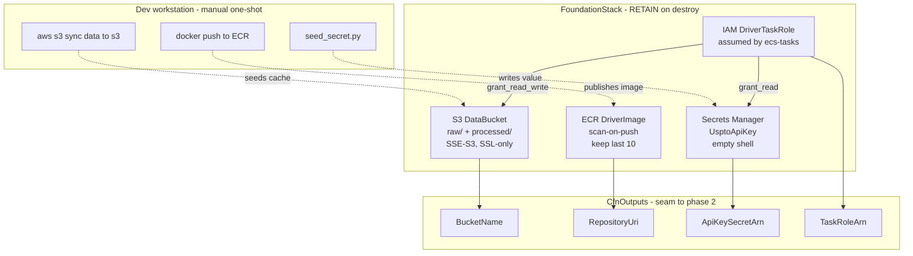
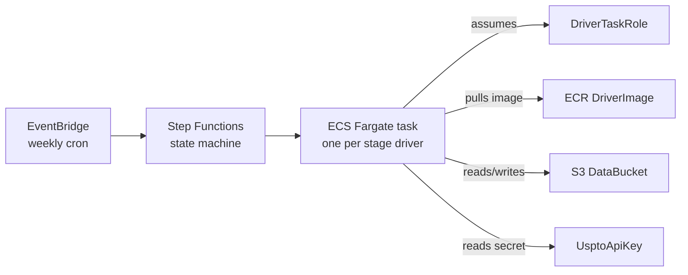

# Foundation Stack — Architecture

Visual companion to `infra/stacks/foundation.py`. The stack owns the **long-lived** primitives (data, image registry, credentials, identity); a future phase-2 stack will own the **ephemeral** orchestration (schedule + execution).

---

## 1. Resource map

---

## 2. Runtime path (phase 2, not yet implemented)

Each weekly run is one Step Functions execution; each stage (trials → petitions/decisions → patents → joiner → features) is one Fargate task with a different `python -m drivers.<X>` argv. All tasks share the same image, role, bucket, and secret — that's why those four resources are foundation-owned.

---

## 3. Why the split

| Concern | Phase 1 (foundation) | Phase 2 (compute/orchestration) |
|---|---|---|
| Durable state | data bucket, image registry, secret | — |
| Identity | task role | execution role |
| Schedule / glue | — | EventBridge, Step Functions, task definitions |
| Removal policy | RETAIN everywhere | DESTROY (safe — no state) |

The split lets you `cdk destroy` the orchestration stack freely while iterating, without risking the cached data or the secret value.

---

## 4. What's deliberately not here

- **No VPC** — Fargate tasks need only HTTPS egress to ODP; default account VPC + a security group is enough. A custom VPC would add NAT gateway costs (~$32/mo) for no security gain.
- **No KMS CMK** — S3-managed keys are free and adequate for this data class.
- **No compute** — task definitions, Step Functions, and EventBridge live in the future phase-2 stack and import the four `CfnOutput`s above.
