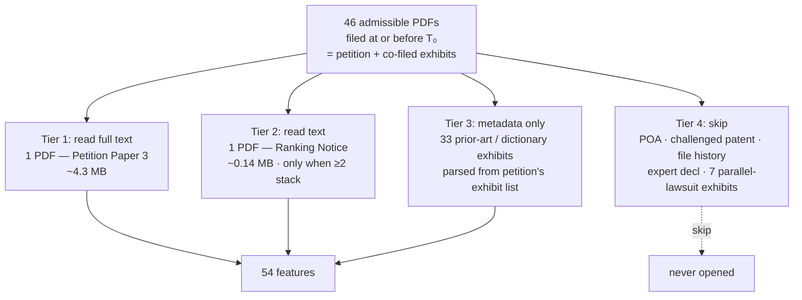
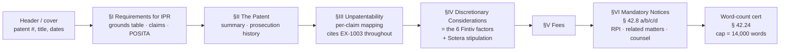

# Admissible Documents — Inspection & Feature Extraction Plan

> Statute / rule citations in this doc (e.g. `§ 42.8`, `§ 315(b)`, `§ 102(e)`) are explained in plain English in `../scope/glossary.md` §4 — the canonical glossary. Same applies for terms like *Fintiv*, *Sotera stipulation*, *POSITA*, *RPI*.

Concrete inspection of the 46 admissible PDFs of `IPR2022-01002` (Samsung+Apple v. Smart Mobile, '083 patent). Output is two-fold: (a) what each document actually contains, and (b) what the per-tier feature pipeline should extract. T₀ = 2022-05-23.

The case has a useful property for this audit: the petitioner is a **joint** Samsung+Apple petition with a **stack-of-two** strategy and an explicit **Sotera-style stipulation**. Petitions this strategically rich expose almost every petition-derivable feature the model will ever need.

---

## 1. Inventory

| Tier | Docs | Action | Cumulative size |
|---|---|---|---:|
| 1 — read full text | Paper 3 (Petition) | parse | 4.3 MB |
| 2 — read text | Paper 2 (Ranking Notice, when present) | parse | +0.14 MB |
| 3 — metadata only | Ex 1004–1030, 1035–1040 (33 prior-art / dictionary) | from petition's exhibit list | 0 MB read |
| 4 — skip | Paper 1 (POA), Ex 1001 (challenged patent), Ex 1002 (file history), **Ex 1003 (Expert Decl)**, **Ex 1031–1034, 1041–1043 (parallel-lawsuit exhibits)** | duplicated or restated by petition | 0 MB read |

**Net text-ingestion budget per trial: ~4.4 MB** (Petition + Ranking Notice). The petition is the only mandatory PDF; the ranking notice is small and only present on petitions that stack ≥2 against the same patent.

> **Two demotions from earlier drafts:** Ex 1003 (Expert Declaration) and Ex 1031–1034, 1041–1043 (parallel-lawsuit exhibits) are now Tier 4. Both contain content the petition itself restates — expert qualifications surface in the petition's citations to the declaration; court dates, forum, judge, and co-defendants surface in petition §IV and §VI.B. Reading these PDFs adds verification, not new categorical features. See §4 (expert) and §5 (parallel-lawsuit) for the cheap proxies that replace them, and `../scope/prediction_scope.md` §8 for the modeling assumption this introduces.

---

## 2. Tier 1 — Petition (Paper 3)

The single most information-dense document in the case. Petitions follow the same skeleton because patent-procedure rules force them to (`../scope/glossary.md` §4):

Each section maps to a band of features in §2.6. Verified extractable signals on this trial:

### 2.1 Header / cover (page 1)
- Patent number: `9,191,083`
- Title: "WIRELESS DEVICE WITH MULTICHANNEL DATA TRANSFER"
- Issue date: 2015-11-17
- Application no.: 14/709,428
- App filing date: 2015-05-11
- Attorney docket: `39843-0127IP1` (firm-internal — useful for clustering petitions from the same firm/matter)
- Petition title cites statute: "PURSUANT TO 35 U.S.C. §§ 311–319, 37 C.F.R. § 42" (confirms IPR; alternative phrasings flag CBM/PGR)

### 2.2 Section I — Requirements for IPR (body p. 1–3)
Critical structured content:
- **Joint petitioners**: "Samsung Electronics Co., Ltd. and Apple Inc. ('Petitioner')". The proceedings record lists only Samsung; this is hidden in the metadata.
- **Challenged claims**: 1–9, 12–20 (= **17 of 20 issued claims**)
- **§315(b) bar status**: "being filed within one year of service of a complaint" → not time-barred
- **Grounds table** (single ground, single basis):

  | Ground | Claims | Basis |
  |---|---|---|
  | 1 | 1-9, 12-20 | §103 — Paulraj in view of Heath |

- **Reference qualification table**:

  | Reference | Date | Statutory basis |
  |---|---|---|
  | Paulraj | 1999-12-15 (filing) | §102(e) |
  | Heath | 2000-04-07 (filing) | §102(e) |

- **Critical date**: 2000-07-17 (priority disclaimed during prosecution from 1999-06-04)
- **Claim construction posture**: "no formal claim constructions are necessary" — a rhetorical move, often correlated with petitions confident they win on plain meaning
- **POSITA definition**: BS in EE/CompE/CS + 2 yrs wireless

### 2.3 Section IV — Discretionary Considerations (body p. 87–88)
Petitioner addresses **all 6 Fintiv factors explicitly** with subheadings — this is the format that makes Fintiv structurally extractable from petitions:

| Factor | Petitioner's framing | Extracted signal |
|---|---|---|
| F1 — Stay | No motion, neutral | binary: stay-discussed=Y, motion-filed=N |
| F2 — Trial date | Jury 2023-10-23, FWD ETA 2023-11 | date pair → days-between metric |
| F3 — Investment | "minimal", fact-disc closes 2023-03-29 | discovery-status enum |
| F4 — Overlapping issues | **Sotera stipulation** ("will cease asserting in the district court any invalidity contention based on the grounds presented") | binary: sotera_stipulation=True (very strong signal) |
| F5 — Petitioner status | Defendant | enum: defendant / non-defendant |
| F6 — Other / merits | "merits are strong" | self-asserted, low-weight |

This whole section is engineered for keyword/section-header extraction. Petitions that *don't* address Fintiv expose themselves to discretionary denial — its very absence is also a feature.

### 2.4 Section VI — Mandatory Notices (body p. 88–90)
- **RPI**: "Samsung Electronics Co., Ltd. and Samsung Electronics America, Inc. … and Apple Inc."
- **Related civil actions**:
  - *Smart Mobile Technologies LLC v. Samsung Electronics Co., Ltd. et al*, 6:21-cv-00701 (W.D. Tex.)
  - *Smart Mobile Technologies LLC v. Apple Inc.*, 6:21-cv-00603 (W.D. Tex.)
- **Lead counsel**: W. Karl Renner, Reg. 41,265, Fish & Richardson P.C., Minneapolis MN (Samsung)
- **Backup counsel**: 5 reg. nos at Fish & Richardson + 2 at Haynes and Boone (Dallas TX, Apple counsel)

### 2.5 Closing administrative
- Word count: **13,949 / 14,000 cap** — petition is at the wall, signals dense argumentation
- Date filed: 2022-05-23
- Patent owner counsel served: **Venable LLP** (NYC)

### 2.6 Petition feature catalog (27 — extractable today)

| # | Feature | Source in petition | Type |
|---|---|---|---|
| 1 | `n_challenged_claims` | Section I.B intro | int |
| 2 | `challenged_claim_set` | Section I.B + claim listing | set[int] |
| 3 | `n_grounds` | Grounds table | int |
| 4 | `statute_basis_set` | Grounds table | set ⊂ {102, 103, 112} |
| 5 | `n_prior_art_references` | Reference table + exhibit list | int |
| 6 | `reference_qualification_basis` | Reference table | enum |
| 7 | `claimed_critical_date` | Section I.B narrative | date |
| 8 | `priority_dispute_flag` | "originally claimed, but later removed" pattern | bool |
| 9 | `claim_construction_posture` | Section I.C | enum: none / proposed / O2 Micro |
| 10 | `posita_education_level` | Section I.D | enum |
| 11 | `posita_experience_years` | Section I.D | int |
| 12 | `within_315b_bar_window` | Section I.A boilerplate ("within one year of service") | bool |
| 13 | `fintiv_addressed` | Section IV header presence | bool |
| 14 | `sotera_stipulation_text` | Section IV.4 | bool + verbatim text |
| 15 | `parallel_litigation_count` | Section VI.B | int |
| 16 | `parallel_litigation_courts` | Section VI.B (case captions) | list[district] |
| 17 | `parallel_trial_dates` | Section IV.2 | list[date] |
| 18 | `n_petitioners` | Section I + RPI | int |
| 19 | `joint_petition_flag` | Section I.B intro | bool |
| 20 | `rpi_entity_count` | Section VI.A | int |
| 21 | `n_lead_counsel + n_backup_counsel` | Section VI.C | ints |
| 22 | `counsel_firms` | Section VI.C | list[str] |
| 23 | `counsel_reg_numbers` | Section VI.C | list[int] (low-IDs ≈ veterans) |
| 24 | `patent_owner_counsel_firm` | Cert. of Service | str |
| 25 | `word_count` | §42.24 certification | int |
| 26 | `word_count_utilization` | word_count / 14000 | float |
| 27 | `attorney_docket` | header | str |

27 structured features from one PDF, before the +2 expert proxies (§4.1) and +11 parallel-lawsuit proxies (§5.1) that bring Tier 1 to 40. Most extract from regex on section headings + small named tables.

---

## 3. Tier 2 — Ranking Notice (Paper 2, ~6 pp)

Filed when a petitioner stacks ≥2 petitions against the same patent (post-July-2019 TPG requirement). Not present on most trials — its existence itself is a feature.

This trial's notice content:

| Rank | Petition | Primary Reference |
|---|---|---|
| 1 | IPR2022-01002 | Paulraj |
| 2 | IPR2022-01003 | Raleigh |

Justification: priority-date dispute (PO claimed 1999-06-04 in the parallel lawsuit despite disclaiming it in prosecution to 2000-07-17). Also notes that Samsung+Apple "have coordinated … as co-petitioners, thereby reducing the burden on Patent Owner".

### 3.1 Ranking-notice features (5)
| # | Feature | Source |
|---|---|---|
| 28 | `ranking_notice_present` | doc lookup (Paper 2 type) |
| 29 | `n_ranked_petitions` | rank table |
| 30 | `sibling_petition_ids` | rank table |
| 31 | `justification_category` | text classify: priority dispute / claim count / different-art / other |
| 32 | `coordinating_defendants_flag` | "co-petitioners" / "coordinated" phrase |

`sibling_petition_ids` is operationally important: it lets the leakage-discipline pipeline enforce the **earliest-petition-only rule** (see `../scope/prediction_scope.md` §4) — when present, the pipeline keeps the rank-1 petition and drops the rank-2 from training.

---

## 4. Demoted source — Expert Declaration *(was Tier 2)*

The expert declaration (Ex 1003, ~5.8 MB) is no longer in the read pipeline. Earlier drafts of this doc had it as a Tier 2 source; on closer inspection the value isn't there:

1. **It's expanded prose of the petition.** The declaration is the technical opinion underlying the petition's claim-by-claim mapping. The categorical facts (which exhibits, which claims, which combinations) are already in the petition. Reading the declaration adds detail, not new categorical signals.
2. **The features I'd proposed were weak.** "PhD vs MS" doesn't discriminate (≈95% of IPR experts hold a PhD). "Industry years" is unreliable to parse from a CV. "Prior IPR count" is high-noise.
3. **The one signal that matters is free elsewhere.** "Was a declaration filed at all?" answers from the petition's exhibit list. "How long is it?" answers from the highest "EX-1003, ¶N" cited in the petition. No second PDF pass needed.
4. **Cost.** ~5.8 MB × 18K trials ≈ 100 GB of additional storage and parsing for features that won't move the needle.

### 4.1 Cheap expert proxies (counted under Tier 1, derived from the petition only)

| # | Feature | Method |
|---|---|---|
| 33 | `expert_declaration_present` | regex `r"Declaration of"` in petition's exhibit list |
| 34 | `n_expert_paragraphs_cited` | max `N` across `r"EX-100\d, ¶+\s*(\d+)"` matches in petition |

Both extracted from the petition we already need to read.

---

## 5. Demoted source — Parallel-Lawsuit Exhibits *(was Tier 2)*

The parallel-lawsuit exhibits (Ex 1031–1034, 1041–1043, ~13.1 MB) are no longer in the read pipeline. These are documents from the **separate district-court infringement lawsuit** that the patent owner filed against the petitioner — the petitioner attaches them as evidence about the parallel proceeding because Fintiv (`../scope/glossary.md` §5) requires the PTAB to know what's happening in court.

Earlier drafts had them as Tier 2; on closer inspection they're redundant for our model:

1. **The petition restates everything categorical.** §IV walks the Fintiv factors with concrete dates and forum names; §VI.B lists case captions. The exhibit PDFs are *evidence backing those claims*, not new facts.
2. **Same fact, two sources.** The trial date is in §IV.2 verbatim ("jury selection 2023-10-23") *and* in Ex 1032's schedule. Reading Ex 1032 just re-extracts what we already have.
3. **Edge cases don't justify the cost.** The only scenario where the exhibits add features is a petition with a sparse §IV — but §IV sparseness is itself a high-signal feature ("petitioner didn't bother → likely weak").

### 5.1 Parallel-lawsuit features now extracted from the petition (counted under Tier 1)

All 11 features previously assigned to these exhibits are recoverable from the petition's §IV and §VI.B:

| # | Feature | Source on petition |
|---|---|---|
| 35 | `court_district` | §VI.B case caption ("(W.D. Tex.)") |
| 36 | `court_judge_name` | §VI.B (when stated) or derived from district |
| 37 | `district_court_filing_date_year` | §VI.B case number ("21-cv-00701" → 2021) |
| 38 | `days_district_complaint_to_petition` | derived from year + assumed mid-year |
| 39 | `district_jury_date` | §IV.2 verbatim |
| 40 | `days_petition_to_jury` | jury_date − T₀ |
| 41 | `days_petition_to_projected_fwd` | §IV.2 verbatim |
| 42 | `jury_before_projected_fwd_flag` | §IV.2 comparison |
| 43 | `n_co_defendants` | §VI.A RPI list |
| 44 | `infringement_contentions_present` | §I.B narrative or §IV.4 |
| 45 | `priority_dispute_present` | §I.B narrative |

Lower precision than parsing the exhibits directly (e.g., we only get *year* of district-court filing, not the exact day) but no second PDF pass needed. The trade-off is documented as a modeling assumption in `../scope/prediction_scope.md` §8.

---

## 6. Tier 3 — Prior-art exhibits (33 PDFs, never opened)

Treat the petition's exhibit list as a tabular feature source. Verified pattern from `EX-1004` through `EX-1040`: every exhibit has a one-line title in the petition's exhibit list of the form "U.S. Patent No. X to Y" / "Foreign App. ZZ to W" / "<Author>, <Title>, <Venue>, <Year>".

### 6.1 Prior-art features (9 — parse from exhibit list, not PDFs)
| # | Feature | Method |
|---|---|---|
| 46 | `n_us_patent_references` | regex "U.S. Patent No." count |
| 47 | `n_foreign_patent_references` | regex "European Patent" / "Canadian Patent" / "WO" |
| 48 | `n_npl_references` | book/journal pattern (no patent number) |
| 49 | `n_dictionary_references` | "Dictionary definition" pattern |
| 50 | `min_reference_year` | parse year from each title |
| 51 | `max_reference_year` | parse year from each title |
| 52 | `mean_reference_age_at_critical_date` | critical_date − reference_year mean |
| 53 | `npl_share` | n_npl / total |
| 54 | `foreign_share` | n_foreign / total |

This audit confirmed all 33 references on this trial parse cleanly with regex.

---

## 7. Tier 4 — Skip

| Doc | Why skipped | Substitute |
|---|---|---|
| Paper 1 (POA) | Counsel info already in Petition §VI.C | Petition §VI.C |
| Ex 1001 (the '083 patent) | Patent metadata is available from the file-wrapper API; full patent text is future work | `/applications/search` / future bulk |
| Ex 1002 (file history) | File-wrapper events are available from the file-wrapper API; full prosecution PDFs are not current features | `/applications/search` / future bulk |
| Ex 1003 (Expert Declaration) | Expanded prose of the petition; the only useful signals (declaration filed? cited paragraph count?) are extractable from the petition itself (see §4.1) | Petition exhibit list + citations |
| Ex 1031–1034, 1041–1043 (parallel-lawsuit exhibits) | Petition §IV / §VI.B restate the categorical facts (forum, dates, judge, co-defendants); exhibits add verification, not features | Petition §IV / §VI.B (see §5.1) |

Removing these from the read pipeline saves ~31.6 MB / trial × 18K trials ≈ **560 GB** of redundant text.

---

## 8. Net feature count

| Tier | Distinct features |
|---|---:|
| 1 — Petition (incl. expert + parallel-lawsuit proxies) | 40 |
| 2 — Ranking notice | 5 |
| 3 — Prior-art metadata (from exhibit list) | 9 |
| **Total from admissible docs alone** | **54** |

This is before joining the patent-side file-wrapper features described in `patent_file_wrapper_features.md`. Current v1 gets those from the live `/applications/search` API; bulk products remain a future scaling option.

### Deferred implementation subset

**Tier A (shipped).** Five regex-derived features land on the joined frame today, listed in `src/ml_uspto/features/schemas/constants.py::PETITION_TEXT_FEATURE_KEYS`:
`n_grounds`, `n_grounds_102`, `n_grounds_103`, `has_sotera_stipulation`, `mentions_fintiv_factors`. Pipeline: `drivers/run_ingest_petition_text.py` fetches each petition's PDF, pdfplumber-extracts under `Stage.PETITION_TEXTS`, and `parse/petitions.py::build_petition_texts_frame` assembles `Frame.PETITION_TEXTS`; the joiner attaches `petition_text` as a column, and `features/petition_text.py::aggregate_petition_text_row` runs the regexes per row. Pattern catalog: `parse/schemas/patterns.py`.

**Tier 1/2 (deferred v2).** The remaining ~50 features in this catalog (structural counts beyond `n_grounds`, ranking-notice fields, prior-art exhibit-list derivations like `npl_share` / `mean_reference_age_at_critical_date`, finer §IV / §VI.B substructure, RPI-list extraction, claim-construction term enumeration) are later schema-additive work. NLP / embeddings on petition text remain out of scope for v1 — Tier A's high-precision regex bar (see CLAUDE.md "Regex feature precision discipline") is the gate any new petition-text feature has to clear.

---

## 9. What this means for v2 ingestion

- **Mandatory per trial in v1**: 1 petition PDF (~4 MB), pdfplumber-extracted under `Stage.PETITION_TEXTS`.
- **Conditional per trial in v2**: 1 ranking notice PDF (~0.14 MB), only when the petitioner stacks ≥2 petitions against the same patent.
- **Never opened**: 33 prior-art exhibits + POA + challenged patent + file history + expert declaration + 7 parallel-lawsuit exhibits (~150 MB / trial saved).

Current v1 ingestion opens petition PDFs (Tier A regex feature inputs); the other categories above remain unopened. Corpus-wide v1 text storage is petitions plus FWD label-fallback text (~2 GB extracted across the cohort).

---

## 10. Cross-references

- `../scope/prediction_scope.md` §4 — leakage rule (the why behind the T₀ filter).
- `../scope/prediction_scope.md` §5.2 — Tier A petition-text features in v1; Tier 1/2 deferred.
- `patent_file_wrapper_features.md` — patent-side features that join on `patentNumber`.
- `../scope/lifecycle_case_study.md` — the full lifecycle this scope deliberately ignores past T₀.
- `src/ml_uspto/parse/petitions.py` — petition picker, assembler, and `build_petition_texts_frame` (cached blobs → `Frame.PETITION_TEXTS`).
- `src/ml_uspto/features/transforms.py` — T₀-filtered structured-feature orchestrator.
- `src/ml_uspto/features/petition_text.py` — Tier A regex aggregator (`aggregate_petition_text_row`, `select_usable_rows`).
- `src/ml_uspto/features/patent_aggregator.py` — patent-side row-local T₀ aggregation off `Frame.PATENTS`.
