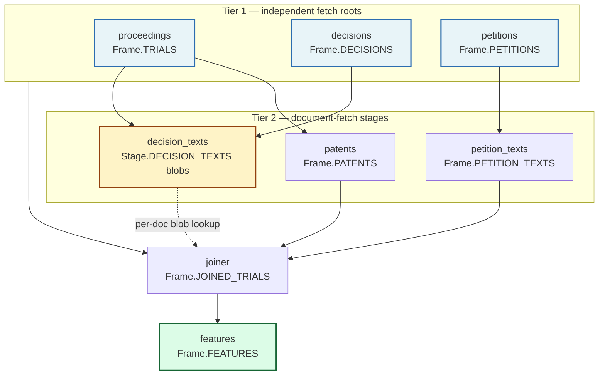
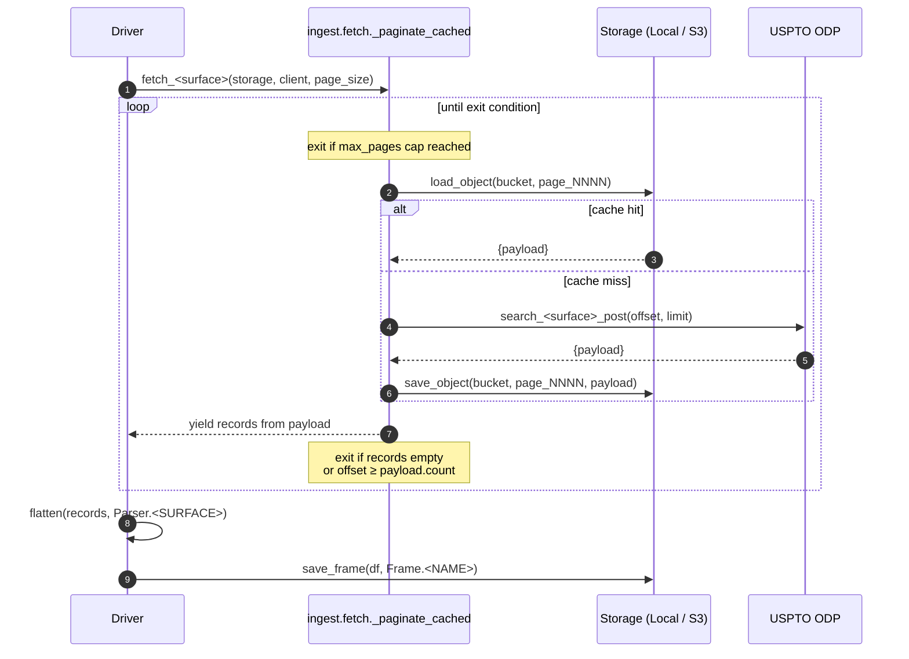
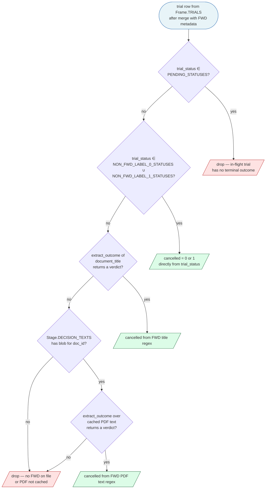

# Refresh Lifecycle

Operator reference for the weekly cron — what runs, in what order, and how each layer persists state. Companion to `docs/api/rate_limits.md` (which budgets the API side).

---

## 1. Persistence model

The mental model in one rule:

> **API is source of truth → overwrite. We accumulate locally → append-only.**

Anything ODP can re-serve gets re-derived each cycle. Anything we paid rate-limit budget for is accumulated.

| Layer | Storage | Semantics | Why |
|---|---|---|---|
| Raw object cache | `<raw_root>/<Stage>/<key>.json` | Per-key overwrite (`save_object`) | API is source of truth; idempotent re-fetch picks up upstream mutations (status flips, reissued decisions) |
| Tabular frames | `<processed_root>/<Frame>.parquet` | Whole-file overwrite (`save_frame`) | Re-flatten from raw is cheap; guarantees the frame matches current cache state |
| FWD text blobs | `<raw_root>/decision_texts/<doc_id>.txt` | Append-only; gap detector skips cached keys. Text is extracted via pdfplumber at fetch-time; the binary PDF is never persisted | PDF-bucket is rate-limit-bound (~1.2M/wk); content is immutable once issued |
| Petition text blobs | `<raw_root>/petition_texts/<trial_number>.txt` | Append-only; gap detector skips cached keys. Text is extracted via pdfplumber at fetch-time; the binary PDF is never persisted. Failed extractions write a `BLANK` sentinel so the trial is dropped at feature build by `features.petition_text.select_usable_rows` rather than retried indefinitely | PDF-bucket is rate-limit-bound; petitions are immutable once filed |

There are no quarantine frames. Patents that fail aggregation are dropped silently from `Frame.PATENTS`; trials with no pickable petition simply don't appear in `Frame.PETITIONS`, and the joiner drops them via inner-join.

---

## 2. Stage DAG

Three independent fetch roots — `proceedings`, `decisions`, `petitions` — each paginate `documents/search`-shaped endpoints with no cross-frame dependency. Confluences are downstream:



**Legend.**
- *Blue* — independent fetch roots (no upstream frame dependency).
- *Amber* — confluence stage that reads two or more upstream frames (`decision_texts` is the only one; `patents` and `petition_texts` each depend on a single upstream frame and are unstyled).
- *Green* — terminal output of the pipeline.
- *Dashed edge* — per-document blob lookup at row time (`build_labels` does `load_blob(Stage.DECISION_TEXTS, doc_id, "txt")` per unresolved FWD row). Other edges are frame-level dependencies, even when the consumer iterates rows internally to compute its work list.

### Order constraints

- **Three independent roots.** `proceedings`, `decisions`, and `petitions` can fetch in any order — they all paginate ODP endpoints with no cross-frame dependency. `assemble_petitions` is pure on the raw records iterator (no `Frame.TRIALS` read); `fetch_decisions` calls `flatten` directly off the cached pages.
- **`patents` depends on `proceedings` only.** The driver loads `Frame.TRIALS["application_number"]` to drive `/applications/search` batches. T₀ filtering happens later, at feature build, off `Frame.TRIALS["petition_filing_date"]` joined onto each patent row — not at patents-fetch time.
- **`decision_texts` is the one true confluence.** `enumerate_missing_fwd_pdfs` reads both `Frame.TRIALS` (for trial-status / trial-type filters) and `Frame.DECISIONS` (for FWD candidates and download URIs), then skips already-cached blobs in `Stage.DECISION_TEXTS`. Its output is text blobs under `Stage.DECISION_TEXTS / <doc_id>.txt`, consulted at label-construction time for FWD-status trials whose title doesn't encode the granular outcome.
- **`petition_texts` depends on `petitions` only.** `enumerate_missing_petition_pdfs` reads `Frame.PETITIONS` for the picked petition's `petition_pdf_uri`, and `Stage.PETITION_TEXTS` for already-cached keys. Output is `Frame.PETITION_TEXTS` (assembled by `parse.petitions.build_petition_texts_frame`), which the joiner left-joins to attach `petition_text` as a column.
- **Joiner waits on all upstream frames.** `parse.joiner.join_all` takes `trials, decisions, petitions, patents, petition_texts` keyword args and reads `Stage.DECISION_TEXTS` blobs per-row inside `parse.labels.build_labels` for label resolution. Features run last off the joined frame.

Concurrency note: ODP enforces **burst = 1** per API key (see `rate_limits.md` §2). The three roots are *logically* parallel but effectively serial against the API when they share a key.

### 2.1 Per-stage cache flow

Each fetch loop is cache-first — `_paginate_cached` consults `storage.load_object(bucket, key)` before any HTTP call. The shape of a single stage's lifecycle:



The loop has three exit conditions, evaluated each iteration: the `max_pages` cap (set only for smoke runs), an empty `records` list on the just-yielded payload, or `offset >= payload["count"]`. The `count` value is part of the cached payload itself, so re-runs against a complete cache use the cached count to terminate without ever reading the API.

The same loop covers cold-start (every page is a miss → API call → cache write) and re-runs (every page is a hit → API skipped). Re-flattening costs ~1s for ~20K records; the parquet always reflects current cache state, so adding a new YAML column means *re-running the ingest driver re-projects existing cached pages without any HTTP* (see §2.2 in the project's CLAUDE.md and the `file_download_uri` change history).

The PDF blob stages (`decision_texts`, `petition_texts`) follow the same pattern with `iter_blob_keys` for the cache-presence test instead of `load_object`.

### 2.2 Label-resolution waterfall

`cancelled` (the binary target) is computed for each labeled trial by `parse.labels.build_labels`. After a `PENDING_STATUSES` pre-filter drops in-flight trials, three resolution layers fire in priority order — each fills rows the previous layer left unresolved:

1. **Status-based** — frozenset lookup against `NON_FWD_LABEL_{0,1}_STATUSES`.
2. **Title regex** — `extract_outcome` over the merged FWD's `document_title`.
3. **Cached PDF text** — `extract_outcome` over `Stage.DECISION_TEXTS / <doc_id>.txt`.

Earlier layers short-circuit, so most trials are settled by status without touching a PDF. Only rows still NaN after layers 1+2 reach the blob fallback, and only those with a `document_identifier` from the FWD merge.



**Diagram conventions** — diamonds are decisions, slash-bracketed boxes (`[/.../]`) are terminal outcomes (label set or row drop), the rounded box is the entry. Edges are labeled `yes`/`no` against the diamond.

**Per-layer counts** are emitted at runtime by `parse.labels.build_labels` — read the actual numbers off the log line:

> `Label resolution — status: <n_status>, title: <n_title>, text: <n_text_resolved>/<n_text_attempted> cached. Dropped <n_unresolved> unresolved (no FWD on file or no cached text).`

Dispositions worth calling out:
- **`Final Written Decision` and `Final Written Decision - Appealed`** are not in any of the three status lists. They flow through layer 1 unresolved and rely on layer 2 (title) or layer 3 (PDF text) for the granular verdict.
- **Trials with no FWD on file** carry NaN for the merged `document_title` and `document_identifier`; layers 2 and 3 can't resolve them, and they hit the `drop — unresolvable` outcome.
- **Pending trials drop separately** as the pre-filter — they don't reach layers 1–3 at all.

---

## 3. Delta-detection invariant

> Every weekly stage is a no-op when nothing changed upstream.

Where this is enforced:

- **PDF gap detector** (`ingest.decisions.enumerate_missing_fwd_pdfs`) — four-layer filter: non-IPR drop, status-resolvable drop, title-resolvable drop, cached-blob skip. A steady-state run with no new FWDs returns 0 candidates. Permanently-broken docs reappear each cycle (cheap at ~30–50 weekly candidates against a 1.2M/wk PDF budget); no failure tracking.
- **Raw cache key-stability** — page numbers (proceedings/decisions) and application numbers (patents) are stable keys; re-fetch overwrites the same `<key>.json`.
- **Frames** — re-flatten is a pure function of raw input. Stable raw → byte-identical frame.

If a stage produces output when nothing changed upstream, the invariant is broken — investigate before shipping.

---

## 4. Retry / picker knobs

| Knob | Where set | Default | When to tune |
|---|---|---|---|
| `--rate-sleep` | `drivers/run_ingest_decision_texts.py` | 2.0s | Tighten only if PDF-bucket budget allows; default keeps cold-run within bucket |
| `--limit` | same driver | none | Use for pre-flight smoke tests (e.g. `--limit 50`) before a full backfill |
| Petition picker rules | `config/petition_picker.yaml` | (existing) | When a trial's filings shape changes and the picker mis-classifies |

Failures are logged inline and yield a `DecisionPdfFetchResult` with `bytes_written=None`. The next cron's gap detector picks the same doc up again — no retry-window state to maintain.

---

## 5. Observed wall-clock

| Run | Volume | Wall-clock | Notes |
|---|---|---|---|
| Cold-run FWD-PDF backfill | 1,089 PDFs | _TBD (in flight 2026-04-30)_ | First full run; numbers populated after completion |
| Pre-flight `--limit 50` | 50 attempts | ~3 min | 48 success / 2 transient `RemoteDisconnected` (auto-retried on next cron) |
| Weekly delta (expected) | ~30–50 PDFs | <5 min | Estimate from FWD issuance cadence; revisit after first weekly run |

---

## 6. Cloud bootstrap (one-shot seed)

The pipeline targets AWS deployment via **Step Functions + ECS Fargate** (one container image, one task per stage; weekly EventBridge trigger). The `Storage` Protocol already abstracts the backend — `clients/storage/s3.py` mirrors `clients/storage/local.py` against S3.

**Before the first cloud run, seed S3 from the local cache** so the cloud doesn't re-pay for what we've already fetched. The `has_blob` / per-key overwrite semantics from §1 mean a seeded backend is indistinguishable from one that fetched the data itself — the gap detector and re-flatten logic are unchanged.

What to seed, in priority order:

| Local | S3 | Why seed |
|---|---|---|
| `data/raw/decision_texts/*.txt` | `s3://<bucket>/raw/decision_texts/` | PDF-bucket budget (~1.2M/wk, tightest); ~63 min wall-clock saved on first run |
| `data/raw/<Stage>/*.json` | `s3://<bucket>/raw/<Stage>/` | Metadata-bucket calls (5M/wk); patents stage is thousands of `/applications` calls |
| `data/processed/*.parquet` | `s3://<bucket>/processed/` | Optional; re-derive cheap, but seeding lets first cloud run skip to features |

S3 keys are byte-identical to local paths under `raw_root` / `processed_root` by construction — `clients/storage/s3.py` mirrors the layout. So the seed is a plain CLI sync, no transformation:

```bash
aws s3 sync data/raw/       s3://<bucket>/raw/
aws s3 sync data/processed/ s3://<bucket>/processed/
```

One-time. Not a recurring stage in the state machine. After the seed, weekly cron does incremental delta work only.

---

## 7. Pointers

- `src/ml_uspto/clients/storage/local.py` — overwrite/append semantics live in `save_object`, `save_frame`, `save_blob`, `has_blob`.
- `src/ml_uspto/ingest/decisions.py::enumerate_missing_fwd_pdfs` — the delta detector.
- `src/ml_uspto/ingest/fetch.py::fetch_decision_pdfs` — fetch loop (logs + skips failures).
- `src/ml_uspto/schemas/enums.py::Frame`, `ingest/schemas/enums.py::Stage` — canonical key names.
- `drivers/run_ingest_decision_texts.py` — driver flags + persistence on exit.
- `docs/api/rate_limits.md` — bucket quotas this lifecycle spends against.
