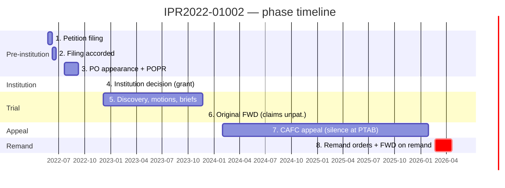
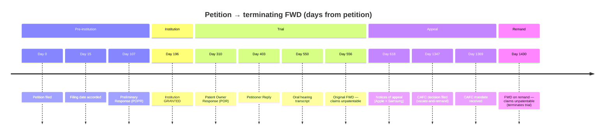
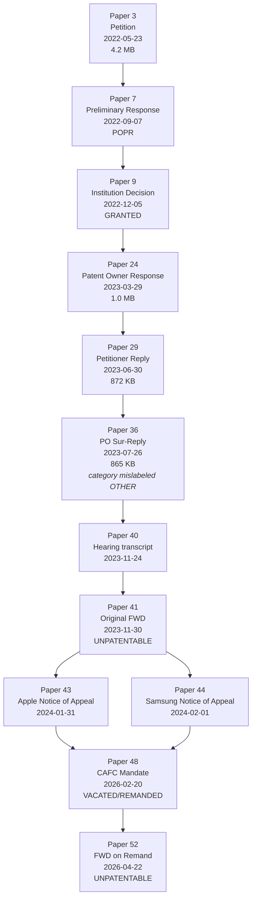
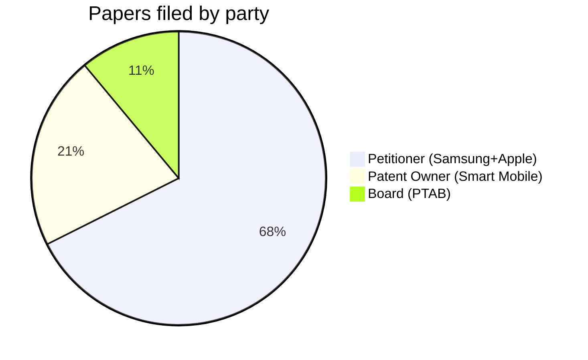

# IPR Lifecycle Case Study — IPR2022-01002

A close-read of one fully-completed IPR trial, used to map how an IPR proceeding actually unfolds in time, what papers exist at each phase, and how the API surfaces (proceedings / decisions / per-document) align to it. The aim is **structural understanding** of the full lifecycle.

> **Scope reminder.** Under `../scope/prediction_scope.md` §4, only events at or before T₀ (the petition filing date) are admissible as features. **Phases 3–8 below are out of scope as feature sources**; they are documented here for orientation and to clarify what the model deliberately ignores. The terminating FWD (Phase 6 or 8) supplies the **label**, never features. See `../features/admissible_documents_analysis.md` for the actual feature pipeline.

Source data on disk: `data/raw/proceedings/IPR2022-01002/`.

---

## 1. Trial at a glance

| Attribute | Value |
|---|---|
| Trial number | **IPR2022-01002** |
| Patent | US 9,191,083 (granted 2015-11-17, app. 14709428) |
| Tech center / art unit | 2400 / 2476 (Networking, Multiplexing, Cable, Security) |
| Patent owner | Smart Mobile Technologies LLC |
| Petitioner(s) | **Samsung Electronics Co.** (lead) + **Apple Inc.** (joined) |
| Petition filed | 2022-05-23 |
| Filing accorded | 2022-06-07 |
| Institution decision | **2022-12-05** — Granted |
| Original FWD | **2023-11-30** — Claims unpatentable |
| CAFC notices of appeal | 2024-01-31 / 02-01 |
| CAFC mandate | 2026-02-20 — Vacated / Remanded |
| FWD on remand | **2026-04-22** — All challenged claims unpatentable |
| Total wall-clock | **~3 years 11 months** (1,430 days from petition to terminating FWD) |
| Total papers | **145** (51 procedural + 94 exhibits) |
| Zip size | 421 MB |

This trial is *not* a representative average — it went through CAFC and back. A vanilla IPR ends at the original FWD (Phase 6 below) and lasts ~18 months total. This case is useful precisely *because* it surfaces the appeal/remand machinery that simpler trials never reveal.

---

## 2. The eight phases



Each phase mapped to its papers and to the API artifacts that mark it:

| # | Phase | Papers | What you can read from the API |
|---|---|---|---|
| 1 | **Petition filing** | 1–3 + 43 exhibits (1001–1043) | `proceedings.petitionFilingDate`, regularPetitionerData (real party / counsel), patentOwnerData (target patent + tech) |
| 2 | **Filing accorded** | 4 | `proceedings.accordedFilingDate`. Difference from `petitionFilingDate` is a small "completeness" signal (15 d here — typical) |
| 3 | **PO appearance + POPR** | 5–7 | Paper 7 categorized as `RESPONSE`. PO counsel revealed in Paper 6. Triggers the institution clock. |
| 4 | **Institution decision** | 9 | `proceedings.institutionDecisionDate`. Paper 9 also surfaces in `decisions/search` *only after* the decision is issued — institution decisions in the decisions endpoint carry `decisionTypeCategory` distinct from FWDs. |
| 5 | **Trial / discovery** | 10–40 | Highest paper density of the case. PHV motions, deposition notices, mandatory-notice updates, exhibit lists, **POR** (Paper 24), **Petitioner Reply** (29), **PO Sur-Reply** (Paper 36, mislabeled — see §6), oral hearing transcript (40). |
| 6 | **Original FWD** | 41 | First record in `decisions/search` with `decisionTypeCategory=Decision` and `trialOutcomeCategory=Final Written Decision`. Carries `statuteAndRuleBag`, `issueTypeBag`, full-paper PDF via `fileDownloadURI`. |
| 7 | **CAFC appeal** | 42–46 | Only Papers 43–44 (notices of appeal) are filed *during* the appeal. Two-year gap then Papers 45–46 ("other court decision") drop the CAFC mandate. PTAB itself does *not* surface CAFC reasoning; only the in-papers references reflect it. |
| 8 | **Remand** | 47–52 | `decisions/search` shows two more decision-type papers: Paper 48 (`trialOutcomeCategory=Vacated/Remanded`) and Paper 52 (`Final Written Decision On CAFC Remand`). `proceedings.terminationDate=2026-04-22` is the closure marker. |

---

## 3. Statutory deadlines vs. actual timing

IPRs run on a tight statutory schedule; large deviations are themselves predictive. For this trial:

| Statutory milestone | Statutory window | Actual elapsed | Slip |
|---|---:|---:|---|
| POPR after petition | ≤ 3 months (~90 d) | **107 d** | +17 d (PO took the full 3 mo + a bit) |
| Institution decision after POPR | ≤ 3 months from POPR / 6 mo from petition | **89 d** from POPR, **196 d** from petition | within window |
| POR after institution | ≤ 3 months | **114 d** | +24 d |
| Petitioner Reply after POR | ≤ 3 months | **93 d** | nominal |
| FWD after institution | ≤ 12 months | **360 d** | nominal (Board uses every day of the 12-month statutory window) |
| Notice of appeal after FWD | ≤ 63 days | **62 d** | last-minute |
| FWD on remand | (no statutory deadline) | **62 d after mandate** | |



**Reading these gaps as features.** Each gap is an extractable continuous variable (`days_petition_to_institution`, `days_institution_to_fwd`, etc.). The shape of the distribution across all ~18K IPRs likely reveals (a) Board behavior shifts across policy regimes (cf. domain notes on directorship cycles), (b) backlog signals that correlate with outcome, and (c) outliers worth flagging — e.g., an institution decision filed at day 240+ usually signals an unusual procedural posture.

---

## 4. Activity histogram

Papers filed per calendar month — three pulses are visible, each tied to a major brief:

```
2022-05  ##############################################  46  (Petition + 43 exhibits)
2022-06  #                                                1
2022-07  ##                                               2
2022-09  ##                                               2  (POPR)
2022-10  #                                                1
2022-12  ###                                              3  (Institution decision)
2023-01  #####                                            5
2023-02  ########                                         8
2023-03  #########                                        9  (POR + 7 PO exhibits)
2023-04  #                                                1
2023-05  #                                                1
2023-06  #######################################         39  (Petitioner Reply + 36 exhibits)
2023-07  ####                                             4
2023-08  ####                                             4
2023-09  ######                                           6
2023-11  ##                                               2  (Hearing + Original FWD)
2024-01  ##                                               2  (Notices of appeal)
2024-02  #                                                1
2026-01  ##                                               2  (CAFC decision)
2026-02  ####                                             4  (Mandate + remand orders)
2026-03  #                                                1
2026-04  #                                                1  (FWD on remand)
```

Active in **22 of 47 months** (47% utilization). Long structural gaps: **2024-03 → 2025-12** — full 22-month silence at PTAB while the case sits at CAFC. That gap is itself a derivable feature: any IPR with > 6 months of zero activity post-FWD has very likely been appealed.

The three exhibit pulses (May 2022 / Jun 2023 / smaller PO bursts in Mar 2023) align tightly with the petition / reply / POR brief schedule. Exhibit count per filing pulse is a usable proxy for evidentiary intensity.

---

## 5. The procedural backbone (substantive papers only)

Stripping the 94 exhibits and the procedural ornament (PHV motions, mandatory notices, deposition notices), 12 papers carry the case:



**Document size as a content-density proxy.** Top non-exhibit papers by file size:

| Paper | Size | Type |
|---:|---:|---|
| 3 | 4,170 KB | Petition |
| 1 | 1,139 KB | Petitioner POA (large only because it bundles signature pages for many counsel) |
| 24 | 1,040 KB | POR |
| 29 | 872 KB | Petitioner Reply |
| 36 | 865 KB | PO Sur-Reply |
| 52 | 604 KB | FWD on remand |
| 41 | 321 KB | Original FWD |

The size ordering tracks the merits hierarchy reasonably well (Petition >> POR ≈ Reply ≈ Sur-Reply >> FWDs), but excluding paper 1 and the FWDs the file size is a weak proxy for argument volume — usable as a feature only with normalization.

---

## 6. The decision arc — 3 decision-type papers

The decisions endpoint returns exactly 3 records for this trial, each carrying structured `decisionData`:

| Paper | Date | `trialOutcomeCategory` | `issueTypeBag` | `statuteAndRuleBag` | Significance |
|---|---|---|---|---|---|
| 41 | 2023-11-30 | `Final Written Decision` | `[103]` | `[37 CFR 42.100, 35 USC 318]` | Original FWD — only obviousness in play |
| 48 | 2026-02-20 | `Vacated/Remanded` | — | — | CAFC mandate landed; PTAB records it as a decision-type paper but no statute/issue tagging |
| 52 | 2026-04-22 | `Final Written Decision On CAFC Remand` | `[102, 103]` | `[37 CFR 42.100, 37 CFR 42.73, 35 USC 311, 35 USC 318]` | FWD on remand — now both **anticipation** and **obviousness** addressed (CAFC apparently directed the Board to consider 102 grounds it had skipped) |

This is exactly the shape the model needs: every meaningful Board decision is a row in the decisions endpoint with structured outcome + grounds tags, no PDF parsing required for these features. The only thing the structured fields *don't* tell us is the *reasoning* — for Fintiv-factor ratings or dispositive-factor identification, the FWD PDF (Paper 41 or 52) must be parsed.

---

## 7. Party dynamics



Petitioner-side papers split internally between Samsung (lead) and Apple (joined). Apple's joinder is visible only by reading paper titles — `regularPetitionerData.realPartyInInterestName` on the proceedings record reads only "Samsung Electronics Co., Ltd. et al." The "et al." hides the joinder structure. **For features that depend on petitioner identity (e.g., serial filer, NPE-targeted), the proceedings field is incomplete** — the full party set has to be reconstructed from notice-of-appeal and mandatory-notice papers.

Exhibit asymmetry by party:

| Filing pulse | Petitioner exhibits (1xxx) | PO exhibits (2xxx) |
|---|---:|---:|
| With petition (2022-05) | 43 | — |
| With POPR (2022-09) | — | 1 |
| Around POR (2023-01–03) | 2 | 8 |
| With Reply (2023-06) | 36 | — |
| Trailing | 1 | 3 |
| **Total** | **82** | **12** |

Petitioner files ~7× more exhibits. This ratio is a candidate feature in itself; ratios near 1 are unusual and may indicate a more contested record.

---

## 8. Data-field fidelity audit

Things the API **gets right**:
- Filing dates: every paper has a `documentFilingDate`. Zero null in 145.
- Paper numbers: monotonic and gap-free except for one skipped number (`14`). Reliable as ordering.
- Decision-side enrichment: 3/3 decision papers have populated `decisionData`.

Things the API **gets wrong or hides**:

1. **Sur-Reply mis-categorized.** Paper 36 ("IPR2022-01002 Sur-Reply FINAL.pdf") has `documentCategory: OTHER` despite being a substantive merits paper roughly equal in weight to the POR. Any feature derived from `documentCategory` alone will systematically miss sur-replies. Workaround: keyword match on `documentName` / `documentTitleText` for `sur-reply`, `sur reply`, `surreply`.
2. **Joinder invisible at the proceedings layer.** Apple's joinder is only inferable from individual paper titles ("Petitioner Apple Inc.'s Notice of Appeal"). Whatever real-party-in-interest field the proceedings POST returns is just the lead petitioner.
3. **Documents endpoint capped at 25 records, no pagination.** `/trials/{trial}/documents` rejects `offset`, `limit`, `pagination.*`, `sort` query params. To enumerate all 145 documents we had to first download the per-trial zip, list the PDF IDs, and call `/trials/documents/{id}` once per document (this endpoint is uncapped). 145 calls × ~0.1 s = ~15 s — viable but should be remembered when budgeting full-corpus ingestion.
4. **`filingPartyCategory` is truncated.** Records show `PATENT OWN` (10 chars) instead of `PATENT OWNER` for 30 of the 31 PO papers. One record breaks ranks with the full string. Normalize on prefix.

---

## 9. From phases to features (mostly out of scope)

> Per `../scope/prediction_scope.md` §4, only Phase 1 features are admissible. Phases 3–8 are listed here for orientation; they are **excluded from the feature pipeline** because every event in those phases occurs after T₀.

| Phase | When | In scope as feature? | What we'd have extracted (now excluded) |
|---|---|---|---|
| 1 Petition (T₀) | Day 0 | **Yes** | tech_center, art_unit, RPI from petition §VI.A, plus full petition-text feature catalog (`../features/admissible_documents_analysis.md` §2.6) |
| 2 Filing accorded | Day 15 | Borderline — `accordedFilingDate` is admissible if equal to T₀; treat with provenance check | days_to_accorded (small "completeness" signal) |
| 3 POPR | Day 107 | **No — post-T₀** | POPR text — would have given PO's Fintiv counter-arguments |
| 4 Institution | Day 196 | **No — post-T₀; supplies label only via terminating FWD logic** | institution_outcome, Fintiv factor ratings, dispositive factor |
| 5 Trial | Days 196–550 | **No — post-T₀** | POR/Reply/Sur-Reply text, motion/order counts, exhibit ratios |
| 6 FWD (orig) | Day 556 | **Label only** (terminating-FWD selection per scope §3) | trialOutcomeCategory, issueTypeBag, statuteAndRuleBag |
| 7 Appeal | Days 618–1369 | **No** | appealed flag, days_fwd_to_notice_appeal, CAFC outcome |
| 8 Remand | Days 1369–1430 | **Label only** (FWD-on-remand becomes the terminating FWD) | days_mandate_to_re_fwd, remand outcome |

Cross-phase composites previously sketched (`pace_score`, `activity_burstiness`, `appeal_likelihood_signal`, `evidentiary_intensity`) are all post-T₀ and excluded.

The actual feature extraction plan lives in `../features/admissible_documents_analysis.md` — Phase 1 only, expanded into 54 petition-derived features.

---

## 10. Caveats and what one trial cannot tell us

This case is structurally rich precisely because it appealed and remanded. About **3% of IPRs** reach a CAFC remand; the modal trial has only Phases 1–6. Open questions for the corpus-level analysis:

1. **What does a typical Phase 5 look like?** This trial had 31 papers in Phase 5; that count likely varies widely by tech center and party identity. Distribution needs to be characterized at corpus scale before features like `n_motions` are usable.
2. **Discretionary denials never enter Phase 5+.** A trial denied institution at Phase 4 has at most ~12 papers total. Feature schemas have to gracefully handle this truncated path.
3. **Settlements terminate mid-trial.** ~22% of trials (4,408 / 19,246) settle. They look like a Phase 5 that ends abruptly with a `Termination - Settled` decision paper rather than a FWD. Lifecycle features must be defined to cope with right-censoring.
4. **Joinder cases share papers across multiple trial numbers.** Apple's appeal here is one of two simultaneous appeals; some joined trials share filings entirely. Care needed to avoid double-counting at corpus scale.
5. **Pre-2025 trials use a different discretionary-denial framework** than post-June-2025 trials (see `../scope/domain_notes.md` on policy regimes). Phase-4 features will need a regime indicator.

---

## 11. Reproducing this analysis

```bash
# Data layout used here
data/raw/proceedings/IPR2022-01002/
  metadata.json                  # proceedings record (1 trial)
  decisions.json                 # decisions endpoint records (3 decision-type papers — label source only)
  all_documents.json             # full 145 records (assembled via per-doc GETs)
  admissible_documents.json      # 46 papers at or before T₀ — feature source
  excluded_documents.json        # 99 papers after T₀ — out of scope, kept only for label verification
  IPR2022-01002.zip              # 421 MB, all 145 PDFs (raw download)
  IPR2022-01002/                 # 46 admissible PDFs (named by documentIdentifier)
    _excluded_post_T0/           # 99 post-T₀ PDFs (moved out of the active feature pool)
```

The full-document index was assembled by:
1. Downloading the per-trial zip via `proceedings.trialMetaData.fileDownloadURI`,
2. Extracting and listing PDF IDs,
3. Calling `GET /api/v1/patent/trials/documents/{documentIdentifier}` once per ID.

For full-corpus ingestion this means **1 zip + N per-document calls per trial**, where N = paper count (median ~30, max ~150). Allowing for the 1.2 M/wk file-wrapper bucket and the 5 M/wk metadata bucket, this fits comfortably — but the per-document iteration is mandatory because the trial-scoped index endpoint is capped at 25.

---

## 12. Related docs

- `../api/api_feature_map.md` — endpoint ↔ feature map (this case study is the worked example).
- `../api/rate_limits.md` — quota implications of per-document iteration at corpus scale.
- `../scope/domain_notes.md` — the legal-domain context (Fintiv factors, policy regimes, statutory deadlines) referenced throughout.
- `../api/proceedings.md` — proceedings-record column dictionary.
