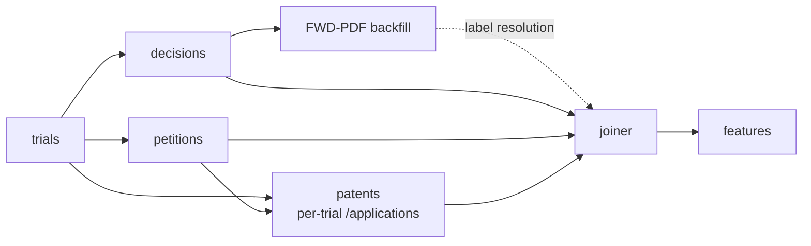

# Refresh Lifecycle

Operator reference for the weekly cron — what runs, in what order, and how each layer persists state. Companion to `docs/api/rate_limits.md` (which budgets the API side).

---

## 1. Persistence model

The mental model in one rule:

> **API is source of truth → overwrite. We accumulate locally → append-only.**

Anything ODP can re-serve gets re-derived each cycle. Anything we paid rate-limit budget for, or any state ODP doesn't carry (our retry bookkeeping), is accumulated.

| Layer | Storage | Semantics | Why |
|---|---|---|---|
| Raw object cache | `<raw_root>/<Stage>/<key>.json` | Per-key overwrite (`save_object`) | API is source of truth; idempotent re-fetch picks up upstream mutations (status flips, reissued decisions) |
| Tabular frames | `<processed_root>/<Frame>.parquet` | Whole-file overwrite (`save_frame`) | Re-flatten from raw is cheap; guarantees the frame matches current cache state |
| PDF blobs | `<raw_root>/decision_pdfs/<doc_id>.pdf` | Append-only; gap detector skips cached keys | PDF-bucket is rate-limit-bound (~1.2M/wk); content is immutable once issued |
| Retry bookkeeping | `Frame.DECISION_PDF_FAILURES` | Append-only, with `failed_at` TTL | Carries state ODP doesn't (our retry window) |

`Frame.PETITION_QUARANTINE` and `Frame.PATENT_QUARANTINE` follow the *frame* row (whole-file rewrite), not the accumulator row — they're re-derived from raw each cycle.

---

## 2. Stage DAG



Order constraints:

- **`trials` must land first.** Petitions, decisions, and patents all key off `Frame.TRIALS`.
- **`decisions` and `petitions` are independent** — can run in parallel after trials.
- **`patents` depends on `petitions`** (needs the picked petition row's `applicationNumberText` + `petitionFilingDate` for T₀).
- **FWD-PDF backfill depends on `decisions`** (gap detector reads `Stage.DECISIONS` raw + `Frame.TRIALS`).
- **Joiner waits on all of the above.** Features run last.

Concurrency note: ODP enforces **burst = 1** per API key (see `rate_limits.md` §2). Stages that share the key are effectively serial against the API even when logically parallel.

---

## 3. Delta-detection invariant

> Every weekly stage is a no-op when nothing changed upstream.

Where this is enforced:

- **PDF gap detector** (`parse.decisions.enumerate_missing_fwd_pdfs`) — five-layer filter: non-IPR drop, status-resolvable drop, title-resolvable drop, cached-blob skip, recent-failure skip. A steady-state run with no new FWDs returns 0 candidates.
- **Raw cache key-stability** — page numbers (proceedings/decisions) and application numbers (patents) are stable keys; re-fetch overwrites the same `<key>.json`.
- **Frames** — re-flatten is a pure function of raw input. Stable raw → byte-identical frame.

If a stage produces output when nothing changed upstream, the invariant is broken — investigate before shipping.

---

## 4. Retry / quarantine knobs

| Knob | Where set | Default | When to tune |
|---|---|---|---|
| `--retry-after-days` | `drivers/run_fetch_decision_pdfs.py` | 7 | Lower if a transient outage clears within hours; raise (or hand-quarantine) if a doc is permanently broken (image-only PDF, 410) |
| `--rate-sleep` | same driver | 2.0s | Tighten only if PDF-bucket budget allows; default keeps cold-run within bucket |
| `--limit` | same driver | none | Use for pre-flight smoke tests (e.g. `--limit 50`) before a full backfill |
| Petition picker quarantine | `config/petition_picker.yaml` | (existing) | When a trial's filings shape changes and the picker mis-classifies |

Failures land in `Frame.DECISION_PDF_FAILURES` with `(document_identifier, reason, http_status, error, failed_at)`. The gap detector re-includes them once `failed_at + retry_after_days` has elapsed.

---

## 5. Observed wall-clock

| Run | Volume | Wall-clock | Notes |
|---|---|---|---|
| Cold-run FWD-PDF backfill | 1,089 PDFs | _TBD (in flight 2026-04-30)_ | First full run; numbers populated after completion |
| Pre-flight `--limit 50` | 50 attempts | ~3 min | 48 success / 2 transient `RemoteDisconnected` (auto-retry via failures TTL) |
| Weekly delta (expected) | ~30–50 PDFs | <5 min | Estimate from FWD issuance cadence; revisit after first weekly run |

---

## 6. Cloud bootstrap (one-shot seed)

The pipeline targets AWS deployment via **Step Functions + ECS Fargate** (one container image, one task per stage; weekly EventBridge trigger). The `Storage` Protocol already abstracts the backend — `clients/s3.py` will mirror `clients/local.py` against S3.

**Before the first cloud run, seed S3 from the local cache** so the cloud doesn't re-pay for what we've already fetched. The `has_blob` / per-key overwrite semantics from §1 mean a seeded backend is indistinguishable from one that fetched the data itself — the gap detector and re-flatten logic are unchanged.

What to seed, in priority order:

| Local | S3 | Why seed |
|---|---|---|
| `data/raw/decision_pdfs/*.pdf` | `s3://<bucket>/raw/decision_pdfs/` | PDF-bucket budget (~1.2M/wk, tightest); ~63 min wall-clock saved on first run |
| `data/raw/<Stage>/*.json` | `s3://<bucket>/raw/<Stage>/` | Metadata-bucket calls (5M/wk); patents stage is thousands of `/applications` calls |
| `data/processed/*.parquet` | `s3://<bucket>/processed/` | Optional; re-derive cheap, but seeding lets first cloud run skip to features |

S3 keys are byte-identical to local paths under `raw_root` / `processed_root` by construction — `clients/s3.py` mirrors the layout. So the seed is a plain CLI sync, no transformation:

```bash
aws s3 sync data/raw/       s3://<bucket>/raw/
aws s3 sync data/processed/ s3://<bucket>/processed/
```

One-time. Not a recurring stage in the state machine. After the seed, weekly cron does incremental delta work only.

---

## 7. Pointers

- `src/ml_uspto/clients/local.py` — overwrite/append semantics live in `save_object`, `save_frame`, `save_blob`, `has_blob`.
- `src/ml_uspto/parse/decisions.py::enumerate_missing_fwd_pdfs` — the delta detector.
- `src/ml_uspto/ingest/fetch.py::fetch_decision_pdfs` — failure-append loop.
- `src/ml_uspto/schemas/enums.py::Frame`, `ingest/schemas/enums.py::Stage` — canonical key names.
- `drivers/run_fetch_decision_pdfs.py` — driver flags + persistence on exit.
- `docs/api/rate_limits.md` — bucket quotas this lifecycle spends against.
