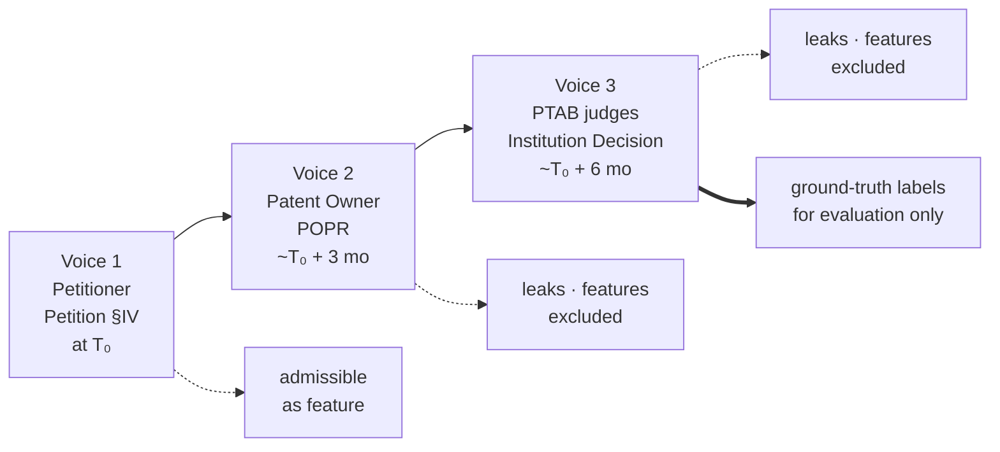

# PTAB Scope and Terminology

Short reference for the PTAB concepts that show up in this project, and what is in/out of scope for the trial-outcome model. Complements `../api/api_feature_map.md` (how to extract features) and `context.md` (why features matter).

---

## 1. Proceeding vs. decision vs. appeal

These three terms are often used interchangeably in casual conversation but sit at different levels in the PTAB data model.

| Term | What it is | Granularity | Where it lives in the API |
|---|---|---|---|
| **Proceeding** | The case itself — one trial challenging one patent. Has a trial number (e.g., `IPR2016-00001`), a type, parties, dates, and a final outcome. | 1 row per case | `/trials/proceedings/search`, `/trials/proceedings/{trial_number}` |
| **Decision** | A ruling *inside* a proceeding. A single proceeding produces several over its lifetime: institution decision (~month 6), procedural decisions, Final Written Decision / FWD (~month 18). | Many per proceeding | `/trials/decisions/search` |
| **Appeal** | Usually refers to **ex parte appeals** — appeals from an examiner's rejection during patent *prosecution* (before grant). Handled by PTAB but **not AIA trials**: no petitioner/patent-owner structure, no Fintiv, no institution gate. Separately, an FWD in an IPR can be appealed *out of* PTAB to the Federal Circuit (CAFC) — that is an appeal out of PTAB, not a PTAB proceeding. | N/A for this project | Out of scope — not modeled |

**Implication for the pipeline:**
- Proceedings = rows and the source of the coarse target label (plus all static `trialMetaData` / party / patent fields ≤ T₀).
- Decisions = label-only. The institution decision and FWD are post-T₀ and **excluded as feature sources** (`prediction_scope.md` §4). Current v1 reads FWD text only to resolve labels. Petition-side Fintiv / 325(d) / Sotera signals **are shipped** as Tier A regex features (`mentions_fintiv_factors`, `has_sotera_stipulation`, `n_grounds_102/103`) over the petition PDF — see §5 below; richer Tier 1/2 petition-text work (declaration counts, RPI-list extraction, embeddings) remains deferred to v2.
- Appeals = filter out; they are a different proceeding category entirely.

### CAFC appeals — label handling, not a filter

Appeals *from* an IPR Final Written Decision *to* the Federal Circuit (CAFC) are **not a separate proceeding type to exclude**. They are downstream events that happen after an FWD. In our probed data (2026-04-24) they show up as a dedicated status:

- `trialStatusCategory: "Final Written Decision - Appealed"` — **591 records** (~3% of the docket).

Treat these as FWDs for target-variable purposes. Whether the CAFC later affirms or reverses is orthogonal to the model's prediction target (the PTAB trial outcome). If we ever want to condition on the CAFC result, `decisionData.appealOutcomeCategory` on the decisions endpoint carries `"Affirmed"` / `"Reversed"` / `"Vacated/Remanded"` values.

---

## 2. Trial types and in-scope filter

The PTAB docket mixes several proceeding categories. The `trial_type` field separates them.

| `trial_type` | Name | Status | In scope? |
|---|---|---|---|
| `IPR` | Inter Partes Review | Active, primary workload | **Yes** — primary target |
| `PGR` | Post-Grant Review | Active, lower volume | Optional — structurally similar to IPR |
| `CBM` | Covered Business Method review | Sunset September 2020 | Optional — historical only |
| `INT` | Interference | Legacy (pre-AIA) | **No** |
| `DER` | Derivation | AIA replacement for interference; very rare | **No** |
| (ex parte appeals) | Prosecution appeals from examiner rejection | Active but different system | **No** |

### Interferences and derivations (why they are out)

- **Interferences** determined *who invented first* under the pre-AIA "first-to-invent" system. The America Invents Act (2013) switched the US to "first-inventor-to-file," eliminating the need for new interferences. A residual tail of pre-AIA cases still closes out at the PTAB, but no new ones are filed.
- **Derivation proceedings** are the AIA-era replacement — narrower, used to prove a later filer derived the invention from an earlier filer. Only a handful per year.
- Neither has the petitioner-vs-patent-owner institution gate, Fintiv analysis, or 325(d) discretionary denial that the model relies on. They share almost no features with IPRs.

### Recommended filter

When pulling proceedings for training, restrict to `trial_type IN ('IPR')` as the default, with `PGR` as an opt-in expansion. Exclude `INT`, `DER`, CBM (unless doing historical analysis), and any ex parte appeal records that surface through adjacent endpoints.

---

## 3. Naming collision: "Petition Decision Search" is NOT PTAB

The ODP catalog exposes two API families that both use the word "decisions." They are completely distinct — easy trap when browsing the catalog.

| Family | URL path | Response bag | Deciding body | In scope? |
|---|---|---|---|---|
| **PTAB Trials — Decisions** | `/api/v1/patent/trials/decisions/*` | `patentTrialDocumentDataBag` | PTAB judges (AIA trial) | **Yes — label source only** |
| **Petition Decision Search** | `/api/v1/petition/decisions/*` | `petitionDecisionDataBag` | USPTO Office of Petitions | **No — prosecution-procedural, unrelated** |

Telltale field on a record: `finalDecidingOfficeName: "OFFICE OF PETITIONS"` → wrong corpus. `trialNumber: "IPR…"` → right corpus.

### What "prosecution-procedural" means

The `/petition/decisions/*` corpus (~7,393 records, probed 2026-04-24) is dominated by Office of Petitions rulings on **procedural** matters during patent **prosecution** — i.e., the examination phase *before* a patent issues:

- **Prosecution** = the examination phase (filing → office actions → allowance/abandonment → grant). Ends before the patent exists; IPRs happen long after prosecution ends.
- **Procedural** (vs. substantive) = about *how* the case is handled (deadlines, fees, forms, case assignment) rather than *whether the invention is patentable* (novelty, obviousness, claim scope).

Top issue types in the corpus (all procedural):
- Patent Prosecution Highway requests (5,957 — 81%)
- Patent Term Adjustment disputes (~1,100)
- Withdrawal of abandonment (75), Waiver or suspension of a rule (80), Refund (26), Review of Technology Center (~200)

### Why this corpus is unusable for our model

1. **Wrong lifecycle.** Events happen before the patent is granted; our model starts at the IPR petition, which happens years after grant.
2. **Wrong dimension.** Procedural process mechanics, not substantive patent-strength signals. Patent strength is what predicts IPR outcomes.
3. **Tiny overlap.** 7K total records across all US patent applications ever. Most IPR'd patents never had an Office of Petitions decision.
4. **Redundant where it does have signal.** Any weak correlates of contentious prosecution (PTA disputes, abandonment revivals) are better captured by `OACT` office actions, `eventDataBag`, and `patentTermAdjustmentData`.

Skip this corpus. If it surfaces in future catalog browsing, the `finalDecidingOfficeName` check is the quickest way to confirm it's not what we want.

---

## 4. Statute and rule reference glossary

PTAB documents are full of cryptic numeric citations like `§ 315(b)`, `§ 102(e)`, `37 C.F.R. § 42.24`. They look interchangeable but come from **two different rulebooks**, and knowing which is which makes the document predictable to parse.

### 4.1 Two systems, side by side

| System | What it is | Analogy |
|---|---|---|
| **35 U.S.C. §** ("U.S.C." = United States Code) | The patent **law** itself, passed by Congress. Says *what is and isn't allowed*. | The school constitution |
| **37 C.F.R. §** ("C.F.R." = Code of Federal Regulations) | The USPTO's **rulebook** — procedural how-to rules the agency writes for itself. Says *how to follow the law*. | The student handbook |

Rule of thumb: **35 U.S.C. = what the case is about** (novelty, obviousness, time bars); **37 C.F.R. = where to find structured info in the document** (mandatory disclosures, word counts).

### 4.2 35 U.S.C. — the law numbers you'll see

| Citation | Plain English | Why it matters for the model |
|---|---|---|
| **§§ 311–319** | "Here's how an Inter Partes Review works" — the section that creates the IPR procedure itself. | Every IPR petition cites this in its title; presence is a sanity check that the document is an IPR (not a CBM/PGR). |
| **§ 315(b)** | "If you've been sued for infringing a patent, you have **1 year** from being served to file an IPR. After that, you're locked out." | High-signal feature: **days between district-court complaint and petition** tells you whether the petitioner is up against the wall (filing in month 11) or moving early (month 2). Petitions filed in month 11 correlate with weaker preparation. |
| **§ 325(d)** | "PTAB can refuse to take a case if the patent examiner already considered the same prior art." | Petitions that recycle old prior art draw discretionary denials; petitions that bring fresh art beat this. Whether `§ 325(d)` is mentioned in the petition is itself a feature. |
| **§ 102** | "An invention can't be patented if it was already known before." Called **novelty**. | One of three legal grounds you can attack a patent on. |
| **§ 102(e)** | A specific flavor of § 102: "an earlier-filed US patent application counts as prior art against you." | Just labels *what kind* of prior art the petition is using. The flavor itself is low-signal; the **count of references** matters more. |
| **§ 103** | "An invention can't be patented if it's an obvious tweak of stuff that was already known." Called **obviousness**. | The most common attack — used in roughly 90% of IPR grounds. |
| **§ 112** | "The patent has to actually explain how to build the invention clearly." Called **written description / enablement**. | Rare in IPRs (it's a district-court favorite), but when it appears it's a strong attack. |

### 4.3 37 C.F.R. — the rulebook numbers you'll see

| Citation | Plain English | Why it matters for the model |
|---|---|---|
| **§ 42.8** | "When you file, you MUST disclose: who you really are (RPI), what other lawsuits exist (related matters), and your lawyers." | This is *why* every petition has a "Mandatory Notices" section with the same subheadings. The rule guarantees the data is there → reliable regex anchors for extraction. |
| **§ 42.24** | "Petitions can't exceed **14,000 words**." | Every petition ends with a certification stating its word count. **Word-count utilization** (count / 14,000) is a cheap feature: petitions hugging the cap are densely argued. |
| **§ 42.6** | "How to serve documents on the other side." | Boilerplate at the end (Certificate of Service); rarely interesting. |
| **§ 42.105** | "How to serve the petition specifically." | Same — boilerplate footer. |

### 4.4 Why we care: regex anchors, not legalese

The numeric citations are reliable parsing landmarks. Patent lawyers literally cannot avoid writing `§ 42.8(b)(1)` before listing the real party in interest, because that's the rule that requires the disclosure. So:

- `regex r"§\s*42\.8\(b\)\(1\)"` → jumps to RPI
- `regex r"§\s*42\.8\(b\)\(2\)"` → jumps to related matters / parallel litigation
- `regex r"§\s*42\.8\(b\)\(3\)"` → jumps to counsel listing
- `regex r"§\s*42\.24"` → jumps to word-count certification
- `regex r"§\s*325\(d\)"` → flags discretionary-denial discussion
- `regex r"§\s*315\(b\)"` → flags time-bar discussion

You don't have to learn patent law to use these — just treat them as section identifiers. The "what does the law actually say" column above is for context when reading docs; the parser only needs the anchor pattern.

### 4.5 Other domain terms (cross-reference)

These come up alongside the statute numbers and have their own implications:

| Term | Plain English | Where to learn more |
|---|---|---|
| **Fintiv factors** | A 6-part test the PTAB uses to decide whether to refuse an IPR because a parallel district-court trial will reach the same answer first. Named after a 2020 PTAB case (*Apple v. Fintiv*). | §5 below + `context.md` |
| **Sotera stipulation** | A petitioner's promise: "if you take this IPR, I will not raise these same invalidity arguments in district court." Used to defuse Fintiv factor 4. Named after the 2020 *Sotera Wireless* case. | `context.md` |
| **General Plastic factors** | A 7-part test for refusing IPRs when a petitioner stacks multiple petitions against the same patent. Named after the 2017 *General Plastic* case. | `context.md` |
| **POPR** | Patent Owner's Preliminary Response — the patent owner's first reply to the petition (~3 months after petition). | §1 above (decision), `../scope/lifecycle_case_study.md` |
| **POR** | Patent Owner Response — the substantive reply after institution. | Same |
| **FWD** | Final Written Decision — the PTAB's final ruling on the merits. | Same |
| **RPI** | Real Party in Interest — the actual entity behind a petition or patent (not just the named party). Required disclosure under § 42.8(b)(1). | §4.3 above |
| **POSITA** | Person of Ordinary Skill in the Art — a hypothetical "average expert in this field" the PTAB uses as a reference for what's "obvious." Every petition defines one. | This doc |
| **Critical date** | The cutoff date for what counts as prior art. Tied to the patent's claimed priority date. | This doc |
| **NPE** | Non-Practicing Entity — a company that owns patents but doesn't make products (often called "patent troll" pejoratively). NPEs sue more aggressively. | `../engineering/features/patent_file_wrapper_features.md` |

---

## 5. Fintiv across the IPR lifecycle

Fintiv is the rule the PTAB uses to decide whether to refuse an IPR because a parallel district-court trial is already underway and will reach the same answer first. It comes up enough in this project to deserve its own walkthrough.

### 5.1 Three voices, three documents

Fintiv gets argued back-and-forth across the lifecycle. Three different parties write about it at three different points:

In a normal courtroom you'd want all three to know what really happened. But our model has to predict the outcome **before voices 2 and 3 exist**, so we only get voice 1.

| Voice | Speaker | Document | When | Available to us at T₀? |
|---|---|---|---|---|
| 1 | The petitioner (the challenger) | Petition §IV "Discretionary Considerations" | At T₀ — petition filing | **Yes** |
| 2 | The patent owner (defending) | Preliminary Response (POPR) | ~3 months after T₀ | **No — leaks** |
| 3 | The PTAB judges (deciding) | Institution Decision | ~6 months after T₀ | **No — leaks** |

### 5.2 Why we never read the POPR or Institution Decision

The POPR contains the patent owner's Fintiv counter-arguments, and the Institution Decision contains the PTAB's official factor-by-factor scoring — both would be richer than what the petition alone offers. But both have `documentFilingDate > T₀` and so leak the future per `prediction_scope.md` §4. They are excluded from the feature pipeline.

If we ever want **ground-truth Fintiv labels** for evaluation or sanity-checking (rather than features), the Institution Decision's text is where the official scoring lives. That's a labeling exercise, not a feature exercise.

The signal we *can* read from the petition is captured today as the Tier A `mentions_fintiv_factors` flag (≥3 distinct factor indices appearing through any of seven phrasing patterns) — see `../engineering/features/admissible_documents_analysis.md` §2.

### 5.3 Cross-references

- `../engineering/features/admissible_documents_analysis.md` §2 — the petition-side §IV signals we actually extract today.
- `context.md` — political-regime context: Fintiv was strengthened, weakened, then strengthened again across three USPTO-director administrations.
- `prediction_scope.md` §4 — the leakage rule that excludes voices 2 and 3.
